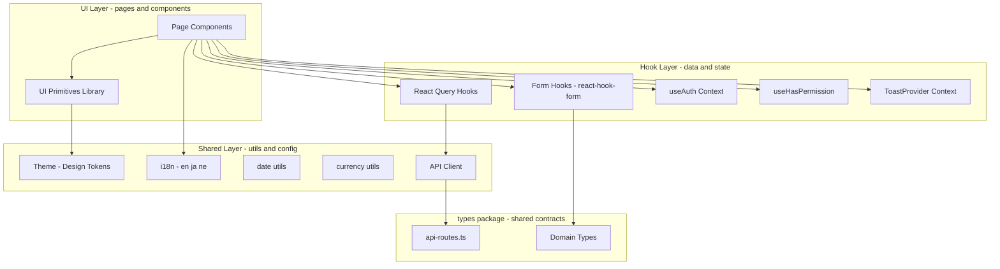
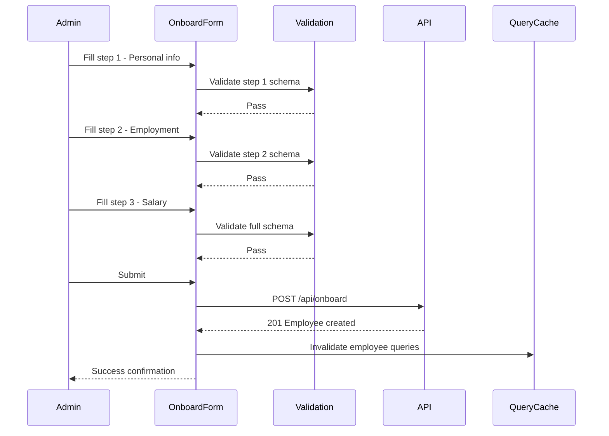
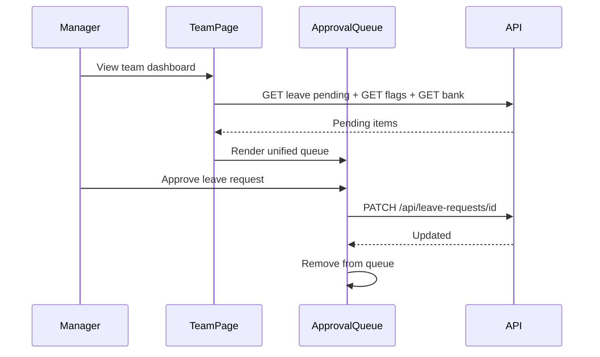

# Design Document — Frontend Redesign

## Overview

**Purpose**: This feature delivers a complete frontend redesign of the HR Attendance App, replacing the current minimal UI with a professional, fully responsive design system and comprehensive page implementations covering admin workflows, team management, and employee experience.

**Users**: Admins use the onboarding/offboarding forms, policy builder, holiday calendar, role editor, and attendance lock management. Managers use the team dashboard with approval queues, team calendar, and report viewer. Employees use the redesigned dashboard, attendance history with editing, leave management, payroll breakdown, flag/banking views, and settings.

**Impact**: Replaces all existing page components with redesigned versions. Preserves and reuses the existing query hooks, API client, auth system, routing structure, and i18n infrastructure. Adds ~11 new UI primitives, ~8 new query hooks, and ~200+ i18n keys.

### Goals
- Fresh, professional UI generated with ui-ux-pro-max design intelligence
- Configurable color system (WillDesign defaults, swappable via theme tokens)
- Fully responsive: mobile (375px) → tablet (768px) → desktop (1440px)
- Complete UI for all 4 priority areas: Admin Core, Team Page, Employee Experience, Attendance Lock
- All user-facing text via i18n `t()` calls in en/ja/ne

### Non-Goals
- Backend handler implementation (API route types added for roles, documents, quotas — handlers to be implemented separately)
- PWA offline mode and push notifications (deferred to future spec)
- Real-time WebSocket updates (polling is sufficient for v1)
- Dark mode
- Cognito production auth (dev-auth continues for now)

---

## Architecture

### Existing Architecture Analysis

The frontend follows a standard React SPA pattern:
- **Routing**: React Router v7 with lazy-loaded pages inside `AuthGuard` and `RoleGuard`
- **State**: React Context (auth) + React Query (server state) — no Redux
- **Styling**: styled-components 6 with centralized `theme.ts` tokens and `primitives.ts` shared components
- **API**: Custom fetch client with JWT Bearer auth, structured query key factory
- **i18n**: react-i18next with 3 locale files (en/ja/ne)
- **Permissions**: `useHasPermission()` hook checking `ROLE_PERMISSIONS` constant

**Patterns to preserve**: Query hook factory pattern, `t()` everywhere, styled-components theming, lazy loading, permission-based nav filtering.

**Technical debt addressed**: Missing primitives (Modal, DataTable, Tabs), incomplete pages (Admin, Team, Settings), no form validation pattern.

### Architecture Pattern & Boundary Map



**App.tsx Provider Hierarchy** (outermost → innermost):
1. `ThemeProvider` (styled-components)
2. `GlobalStyle`
3. `ToastProvider` (new — manages toast state, renders toast container)
4. `QueryClientProvider` (React Query)
5. `AuthProvider` (custom context)
6. `BrowserRouter` (React Router)

**Architecture Integration**:
- Selected pattern: **Component Library + Page Replacement** — new `components/ui/` directory with headless primitives, new page components replacing existing ones
- Domain boundaries: UI primitives are stateless; pages orchestrate hooks and primitives; hooks own API communication
- Existing patterns preserved: query key factory, `t()` i18n, styled-components theming, lazy loading
- New components rationale: 11 primitives needed for forms, tables, calendars that don't exist
- Steering compliance: styled-components only, no CSS files, `t()` for all text, `date-utils` for dates

### UI Component Directory Structure

```
packages/web/src/
├── components/
│   ├── ui/                        # NEW: UI primitives library
│   │   ├── index.ts               # Barrel export (all primitives)
│   │   ├── Modal.tsx
│   │   ├── DataTable.tsx
│   │   ├── Tabs.tsx
│   │   ├── Calendar.tsx
│   │   ├── FormWizard.tsx
│   │   ├── Badge.tsx
│   │   ├── Toast.tsx              # Toast component + ToastProvider + useToast
│   │   ├── ProgressBar.tsx
│   │   ├── EmptyState.tsx
│   │   ├── Skeleton.tsx
│   │   └── SearchInput.tsx
│   ├── common/
│   │   ├── Layout.tsx             # Existing — keep as-is
│   │   ├── LoadingSpinner.tsx     # Existing — keep as-is
│   │   └── ErrorCard.tsx          # Existing — keep as-is
│   ├── dashboard/                 # Redesigned pages
│   ├── attendance/
│   ├── leave/
│   ├── reports/
│   ├── payroll/
│   ├── team/
│   ├── admin/
│   │   ├── AdminPage.tsx
│   │   ├── OnboardingTab.tsx
│   │   ├── OffboardingTab.tsx
│   │   ├── PolicyTab.tsx
│   │   ├── HolidayTab.tsx
│   │   ├── RolesTab.tsx
│   │   └── AttendanceLockTab.tsx
│   ├── settings/
│   └── auth/
├── theme/
│   ├── theme.ts                   # Expanded tokens
│   ├── primitives.ts              # DEPRECATED — re-exported from ui/index.ts
│   ├── GlobalStyle.ts             # Expanded with CSS custom properties
│   └── styled.d.ts
```

**Migration strategy for `primitives.ts`**:
- Existing primitives (Card, Button*, SectionTitle, TextMuted, FormField, PageLayout, FormLayout) are moved to `components/ui/` as individual files
- `theme/primitives.ts` becomes a re-export barrel: `export { Card, Button, ButtonPrimary, ... } from '../components/ui';`
- Existing pages continue working unchanged via the re-export
- New pages import directly from `components/ui/`
- `primitives.ts` is marked with a `@deprecated` comment for eventual removal

### Technology Stack

| Layer | Choice / Version | Role in Feature | Notes |
|-------|------------------|-----------------|-------|
| Frontend Framework | React 19.2.4 | Component rendering | Existing |
| Styling | styled-components 6.3.12 | CSS-in-JS theming | Existing, maintenance mode but stable |
| Server State | @tanstack/react-query 5.96.1 | API data fetching, caching | Existing |
| Form Validation | react-hook-form 7.72 + @hookform/resolvers + Zod | Form state, per-field validation | **New dependency** |
| Calendar | react-day-picker 9.14 | Monthly calendar views | **New dependency** |
| Data Table | @tanstack/react-table 8.21 | Sortable, filterable tables | **New dependency** |
| i18n | react-i18next 17.0.2 | Multi-language UI | Existing |
| Design Intelligence | ui-ux-pro-max skill | Theme generation, style selection | Installed skill |
| Routing | react-router-dom 7.14 | Page navigation | Existing |
| Build | Vite 8 | Dev server, bundling | Existing |

---

## System Flows

### Admin Onboarding Flow



### Manager Approval Flow



---

## Requirements Traceability

| Requirement | Summary | Components | Key Interfaces |
|-------------|---------|------------|----------------|
| 1.1-1.6 | Configurable design system | ThemeProvider, ui/ primitives | AppTheme, BaseUIProps |
| 2.1-2.7 | Responsive layout shell | Layout, BottomNav, Sidebar | Breakpoint hooks |
| 3.1-3.6 | Admin onboarding | OnboardingTab, FormWizard | OnboardFormData, useOnboard |
| 4.1-4.6 | Admin offboarding | OffboardingTab, SettlementPreview | OffboardFormData, useOffboard |
| 5.1-5.6 | Policy builder | PolicyTab, PolicyEditor, CascadeView | usePolicies, EffectivePolicy |
| 6.1-6.6 | Holiday calendar | HolidayTab, CalendarGrid | useHolidays, useCreateHoliday |
| 7.1-7.6 | Role management | RolesTab, PermissionPicker | useRoles |
| 8.1-8.7 | Attendance lock complete | AttendanceLockTab (extended) | useAttendanceLocks |
| 9.1-9.7 | Team page manager | TeamPage, ApprovalQueue, TeamCalendar | useTeamMembers, usePendingApprovals |
| 10.1-10.7 | Attendance history and editing | AttendancePage, AttendanceCalendar, EditForm | useAttendanceEvents |
| 11.1-11.6 | Flag management | FlagsPanel, ResolutionDialog | useFlags, useResolveFlag |
| 12.1-12.6 | Hours banking | BankPanel, BankTimeline | useBank, useBankApprove |
| 13.1-13.6 | Payroll breakdown | PayrollPage (redesigned) | usePayroll, PayrollBreakdown |
| 14.1-14.6 | Settings page | SettingsPage (redesigned) | useCurrentUser |
| 15.1-15.5 | Audit log viewer | AuditPanel | useAudit, AuditEntry |
| 16.1-16.5 | i18n expansion | All components | t() calls, locale files |
| 17.1-17.6 | Leave enhancements | LeavePage (redesigned), TeamLeaveCalendar | useLeaveRequests, useLeaveBalance |
| 18.1-18.5 | Reports enhancements | ReportsPage (redesigned) | useReports |
| 19.1-19.6 | Dashboard redesign | DashboardPage (redesigned), ClockWidget | useAttendanceState |
| 20.1-20.4 | Document management | DocumentsPanel | useDocuments |
| 21.1-21.3 | Probation tracking | ProbationBadge | Employee.probationEndDate |
| 22.1-22.4 | Quota redistribution | QuotaEditor | useQuotas |

---

## Components and Interfaces

### Component Summary

| Component | Domain | Intent | Req Coverage | Key Dependencies | Contracts |
|-----------|--------|--------|-------------|-----------------|-----------|
| ThemeProvider + theme.ts | Design System | Configurable design tokens | 1 | styled-components (P0) | State |
| Modal | UI Primitive | Overlay dialog with backdrop | 4, 6, 8, 11 | Portal (P0) | — |
| DataTable | UI Primitive | Sortable, filterable table | 7, 8, 9, 15 | @tanstack/react-table (P0) | — |
| Tabs | UI Primitive | Tab navigation | 5, 8 | — | — |
| Calendar | UI Primitive | Monthly calendar grid | 6, 9, 10, 17 | react-day-picker (P0) | — |
| FormWizard | UI Primitive | Multi-step form container | 3 | react-hook-form (P0) | — |
| Badge | UI Primitive | Status indicator | 9, 10, 21 | — | — |
| Toast | UI Primitive | Notification feedback | All mutations | — | State |
| ProgressBar | UI Primitive | Hours progress visualization | 10, 19 | — | — |
| EmptyState | UI Primitive | No-data placeholder | All lists | — | — |
| Skeleton | UI Primitive | Loading placeholder | All pages | — | — |
| OnboardingTab | Admin | Multi-step employee creation | 3 | FormWizard (P0), useOnboard (P0) | Service |
| OffboardingTab | Admin | Settlement preview + offboard | 4 | Modal (P0), useOffboard (P0) | Service |
| PolicyTab | Admin | Policy viewer and editor | 5 | Tabs (P0), usePolicies (P0) | Service |
| HolidayTab | Admin | Regional holiday CRUD | 6 | Calendar (P0), useHolidays (P0) | Service |
| RolesTab | Admin | Role/permission editor | 7 | useRoles (P1) | Service |
| AttendanceLockTab | Admin | Company/group/employee locks | 8 | useAttendanceLocks (P0) | Service |
| TeamPage | Manager | Team overview + approvals | 9 | DataTable (P0), ApprovalQueue (P0) | Service |
| DashboardPage | Employee | Clock widget + status overview | 19 | ClockWidget (P0), ProgressBar (P1) | State |
| AttendancePage | Employee | History + editing | 10 | Calendar (P0), Modal (P1) | Service |
| LeavePage | Employee | Requests + team calendar | 17 | Calendar (P1), useLeaveRequests (P0) | Service |
| PayrollPage | Employee | Detailed salary breakdown | 13 | usePayroll (P0) | — |
| ReportsPage | Employee | Daily reports + references | 18 | useReports (P0) | — |
| SettingsPage | Employee | Preferences + profile | 14 | useCurrentUser (P0) | State |

---

### Design System Layer

#### ThemeProvider + theme.ts

| Field | Detail |
|-------|--------|
| Intent | Provide configurable design tokens to all styled-components via ThemeProvider |
| Requirements | 1.1, 1.2, 1.3, 1.4 |

**Responsibilities & Constraints**
- Define all visual tokens: colors (primary, accent, background, surface, semantic states), typography (heading + body + mono font stacks), spacing scale (4/8/16/24/32/48px), border radii (4/8/12px), shadows, breakpoints (640/1024px), transitions
- Emit CSS custom properties (`--wd-color-*`, `--wd-font-*`) via GlobalStyle for external consumption
- WillDesign defaults: primary `#000000`, accent `#58C2D9`, background `#FFFFFF`, heading font "Silom"
- Color values flow from `packages/types/src/branding.ts` → `theme.ts` so deployers change one file

**Contracts**: State [x]

##### State Management
- Theme object passed to styled-components `ThemeProvider` at App root
- CSS custom properties emitted in `GlobalStyle` via `createGlobalStyle`
- No runtime theme switching in v1 (compile-time configuration)

**Implementation Notes**
- Use ui-ux-pro-max skill to generate spacing rhythm, typography scale, and color harmony validation
- Existing `theme.ts` structure preserved but expanded with new tokens for shadows, focus rings, overlay colors
- All existing primitives (Card, Button*, FormField, etc.) continue working unchanged

---

### UI Primitives Layer

All UI primitives extend a common pattern: stateless, themed via `styled-components`, accepting `className` for composition. Detailed blocks only for components with non-trivial logic.

#### Modal

| Field | Detail |
|-------|--------|
| Intent | Overlay dialog with backdrop, focus trap, and escape-to-close |
| Requirements | 4.1, 4.6, 6.4, 8.5, 11.4 |

**Dependencies**
- Outbound: React Portal — DOM rendering outside component tree (P0)

**Contracts**: State [x]

```typescript
interface ModalProps {
  readonly isOpen: boolean;
  readonly onClose: () => void;
  readonly title: string;
  readonly size?: "sm" | "md" | "lg";
  readonly children: React.ReactNode;
}
```

**Implementation Notes**
- Renders into `document.body` via `createPortal`
- Traps focus within modal when open (tab cycling)
- Closes on Escape key and backdrop click
- Prevents body scroll when open

#### DataTable

| Field | Detail |
|-------|--------|
| Intent | Sortable, filterable, paginated table with styled-component cells |
| Requirements | 7.1, 8.4, 9.1, 15.1 |

**Dependencies**
- External: @tanstack/react-table v8 — headless table logic (P0)

**Contracts**: Service [x]

```typescript
interface DataTableProps<TData> {
  readonly data: readonly TData[];
  readonly columns: readonly ColumnDef<TData>[];
  readonly searchable?: boolean;
  readonly searchPlaceholder?: string;
  readonly pageSize?: number;
  readonly onRowClick?: (row: TData) => void;
  readonly emptyMessage?: string;
  readonly loading?: boolean;
}
```

**Implementation Notes**
- Wraps `@tanstack/react-table` `useReactTable` hook
- Sorting via column header click (ascending → descending → none)
- Global search filter across all string columns
- Pagination with page size selector (10/25/50)
- Loading state renders Skeleton rows
- Empty state renders EmptyState component

#### Calendar

| Field | Detail |
|-------|--------|
| Intent | Monthly calendar grid with event overlay support |
| Requirements | 6.1, 9.4, 10.1, 17.4 |

**Dependencies**
- External: react-day-picker v9 — headless calendar (P0)
- Inbound: i18n locale — date formatting (P1)

**Contracts**: Service [x]

```typescript
interface CalendarProps {
  readonly selectedDate?: Date;
  readonly onDateSelect?: (date: Date) => void;
  readonly events?: ReadonlyMap<string, readonly CalendarEvent[]>;
  readonly renderDay?: (date: Date, events: readonly CalendarEvent[]) => React.ReactNode;
  readonly month?: Date;
  readonly onMonthChange?: (month: Date) => void;
}

interface CalendarEvent {
  readonly id: string;
  readonly label: string;
  readonly variant: "info" | "success" | "warning" | "danger";
}
```

**Implementation Notes**
- Wraps `react-day-picker` `DayPicker` component with styled-component overrides
- Events rendered as colored dots or badges below date number
- Responsive: full grid on desktop/tablet, compact list on mobile (< 640px)
- Locale-aware month/day names via i18next `language` detection

#### FormWizard

| Field | Detail |
|-------|--------|
| Intent | Multi-step form container with per-step validation and progress indicator |
| Requirements | 3.1, 3.6 |

**Dependencies**
- External: react-hook-form v7 — form state management (P0)
- External: Zod — per-step schema validation (P0)

**Contracts**: Service [x]

```typescript
interface FormWizardProps<TFormData extends Record<string, unknown>> {
  readonly steps: readonly FormWizardStep<TFormData>[];
  readonly onSubmit: (data: TFormData) => void;
  readonly isSubmitting?: boolean;
}

interface FormWizardStep<TFormData> {
  readonly label: string;
  readonly schema: ZodSchema;
  readonly render: (form: UseFormReturn<TFormData>) => React.ReactNode;
}
```

**Implementation Notes**
- Uses `react-hook-form` `FormProvider` for shared form state across steps
- Each step defines a Zod schema; validation runs on "Next" click
- Progress indicator shows step labels with completed/current/upcoming states
- Back button does not lose filled data (form state persists)
- Final step runs full schema validation before `onSubmit`

#### Tabs, Badge, Toast, ProgressBar, EmptyState, Skeleton

Summary-only primitives (stateless presentation components):

- **Tabs**: Horizontal tab bar with active indicator. Props: `tabs: {label, key}[]`, `activeKey`, `onChange`. Renders styled tab buttons.
- **Badge**: Inline colored pill with label. Props: `variant: "info" | "success" | "warning" | "danger"`, `label`. Uses theme semantic colors.
- **Toast**: Notification bar that auto-dismisses. `ToastProvider` wraps the app (see Provider Hierarchy above) and exposes `useToast()` hook returning `{ show(message, variant) }`. Toast container renders in fixed position top-right via portal. Auto-dismiss after 4 seconds with manual close button.
- **ProgressBar**: Horizontal fill bar. Props: `value: number`, `max: number`, `variant?`. Shows percentage label.
- **EmptyState**: Centered icon + message + optional action button. Props: `icon`, `message`, `action?`.
- **Skeleton**: Animated placeholder matching content dimensions. Props: `width`, `height`, `variant: "text" | "circle" | "rect"`.

---

### Admin Layer

#### OnboardingTab

| Field | Detail |
|-------|--------|
| Intent | Multi-step employee creation form for admin onboarding workflow |
| Requirements | 3.1, 3.2, 3.3, 3.4, 3.5, 3.6 |

**Dependencies**
- Inbound: FormWizard — step management (P0)
- Outbound: useOnboard mutation — POST /api/onboard (P0)
- Outbound: useEmployees query — manager selector (P1)

**Contracts**: Service [x]

```typescript
interface OnboardFormData {
  // Step 1: Personal
  readonly name: string;
  readonly email: string;
  readonly slackId: string;
  readonly languagePreference: LanguagePreference;

  // Step 2: Employment
  readonly employmentType: EmploymentType;
  readonly region: Region;
  readonly managerId: string;
  readonly joinDate: string;

  // Step 3: Salary
  readonly salaryAmount: number;
  readonly currency: Currency;
  readonly salaryType: SalaryType;
}
```

**Implementation Notes**
- 3 steps: Personal Info → Employment Details → Salary Setup
- Employment type dropdown auto-suggests policy group (read-only hint, admin can override)
- Manager field: searchable combobox filtering `useEmployees()` results
- On success: invalidate employee queries, show success toast with new employee summary

#### OffboardingTab

| Field | Detail |
|-------|--------|
| Intent | Employee offboarding with settlement preview dialog |
| Requirements | 4.1, 4.2, 4.3, 4.4, 4.5, 4.6 |

**Dependencies**
- Inbound: Modal — settlement preview (P0)
- Outbound: useOffboard mutation — POST /api/offboard/:id (P0)
- Outbound: useEmployees query — employee selector (P0)

**Contracts**: Service [x]

```typescript
interface OffboardFormData {
  readonly employeeId: string;
  readonly terminationType: "WITHOUT_CAUSE" | "FOR_CAUSE" | "MUTUAL" | "RESIGNATION";
  readonly lastWorkingDate: string;
  readonly exitNotes: string;
  readonly noticePeriodBuyout: boolean;
  readonly curePeriodDate?: string;
}
```

**Implementation Notes**
- Employee selector (searchable, active employees only)
- On "Offboard" click: open Modal with settlement preview (API returns calculation)
- FOR_CAUSE termination shows cure period date input
- Cancel returns to form without state change
- On confirm: call API, show success with post-termination dates

#### PolicyTab

| Field | Detail |
|-------|--------|
| Intent | Policy group viewer/editor with cascade visualization |
| Requirements | 5.1, 5.2, 5.3, 5.4, 5.5, 5.6 |

**Dependencies**
- Outbound: usePolicies query — GET /api/policies/:groupName (P0)
- Outbound: useUpdatePolicy mutation — PUT /api/policies/:groupName (P0)
- Inbound: Tabs — policy domain sections (P1)

**Contracts**: Service [x]

```typescript
// New hook
interface UsePoliciesReturn {
  readonly policy: EffectivePolicy | undefined;
  readonly rawPolicy: RawPolicy | undefined;
  readonly isLoading: boolean;
  readonly error: Error | null;
}

// New hook
interface UseUpdatePolicyReturn {
  readonly mutate: (data: { groupName: string; policy: RawPolicy }) => void;
  readonly isPending: boolean;
}
```

**Implementation Notes**
- Left panel: policy group list. Right panel: resolved policy detail
- 9 tab sections: Hours, Leave, Overtime, Compensation, Probation, Flags, Payment, Report, Salary Statement
- Cascade visualization: stacked cards showing company → group → employee values with override indicators
- Each field shows source level (badge: "Company" | "Group" | "Employee")
- Edit mode: form fields for the selected group level only (not company defaults)

#### HolidayTab

| Field | Detail |
|-------|--------|
| Intent | Regional holiday calendar with CRUD operations |
| Requirements | 6.1, 6.2, 6.3, 6.4, 6.5, 6.6 |

**Dependencies**
- Inbound: Calendar — monthly grid display (P0)
- Outbound: useHolidays query (P0)
- Outbound: useCreateHoliday, useDeleteHoliday mutations (P0)

**Contracts**: Service [x]

```typescript
// New hooks needed
interface UseCreateHolidayReturn {
  readonly mutate: (data: CreateHolidayBody) => void;
  readonly isPending: boolean;
}

interface UseDeleteHolidayReturn {
  readonly mutate: (params: { region: string; date: string }) => void;
  readonly isPending: boolean;
}
```

**Implementation Notes**
- Region filter tabs (JP / NP)
- Calendar grid with holiday markers (colored dots: blue for seeded, green for custom)
- "Add Holiday" button opens Modal with form: date picker, name (en), name (ja), region, substitute toggle
- Delete: confirmation Modal before API call
- Responsive: calendar grid on desktop/tablet, scrollable list on mobile

#### RolesTab

| Field | Detail |
|-------|--------|
| Intent | Role viewer/editor with grouped permission picker |
| Requirements | 7.1, 7.2, 7.3, 7.4, 7.5, 7.6 |

**Dependencies**
- Outbound: useRoles query/mutation (P1 — API route not yet defined)

**Contracts**: Service [x]

```typescript
interface PermissionGroup {
  readonly domain: string;
  readonly permissions: readonly {
    readonly key: string;
    readonly label: string;
    readonly checked: boolean;
    readonly locked: boolean;
  }[];
}
```

**Implementation Notes**
- Role list with user count badges
- Permission picker: grouped checkboxes by domain (attendance, leave, payroll, flags, bank, admin, reports, holidays)
- Super Admin permissions shown as locked (non-toggleable)
- New role creation: name + description + permission picker
- API routes added: `GET/PUT /api/roles`, `GET/PUT /api/roles/:name` defined in api-routes.ts with typed `RoleBody`

#### AttendanceLockTab (Extended)

| Field | Detail |
|-------|--------|
| Intent | Lock attendance at company, group, and employee scopes with bulk operations |
| Requirements | 8.1, 8.2, 8.3, 8.4, 8.5, 8.6, 8.7 |

**Dependencies**
- Outbound: useAttendanceLocks, useCreateLock, useDeleteLock — all existing (P0)
- Outbound: useEmployees — employee list for employee-scope (P1)

**Contracts**: Service [x] (existing hooks, extended UI)

**Implementation Notes**
- Month picker (existing) + 3 scope tabs: Company | Group | Employee
- Company tab: existing single toggle (preserve current functionality)
- Group tab: DataTable listing employment groups with lock status toggle per row
- Employee tab: searchable DataTable with lock status toggle per row
- "Lock All" button: sends batch `POST /api/attendance/lock` for all items in current scope
- Lock status uses Badge (green = unlocked, red = locked)

---

### Manager Layer

#### TeamPage (Redesigned)

| Field | Detail |
|-------|--------|
| Intent | Comprehensive team dashboard with member status, approval queues, calendar, and reports |
| Requirements | 9.1, 9.2, 9.3, 9.4, 9.5, 9.6, 9.7 |

**Dependencies**
- Outbound: useTeamMembers query (P0)
- Outbound: usePendingLeaveRequests query (P0)
- Outbound: useFlags query (P1)
- Outbound: useBank query (P1 — new hook)
- Inbound: DataTable — member list (P0)
- Inbound: Calendar — team leave calendar (P1)
- Inbound: Tabs — section navigation (P0)

**Contracts**: Service [x]

```typescript
// New composite hook
interface UseTeamDashboardReturn {
  readonly members: readonly Employee[];
  readonly pendingLeave: readonly LeaveRequest[];
  readonly pendingFlags: readonly Flag[];
  readonly pendingBank: readonly BankEntry[];
  readonly isLoading: boolean;
}
```

**Implementation Notes**
- 4 tabs: Overview | Approvals | Calendar | Reports
- Overview: card grid showing team members with name, avatar placeholder, employment type, region, today's status badge (Idle/Working/Break)
- Approvals: unified list with type badge (Leave/Flag/Bank), details, approve/reject buttons. Leave approval shows remaining balance. Flag resolution shows resolution options dropdown. Bank shows surplus hours.
- Calendar: monthly calendar with leave markers per team member (colored by employee)
- Reports: date picker + employee filter, showing daily report list with JIRA/GitHub references as links
- Click member name → navigate to employee detail (attendance, hours, flags for that employee)
- Responsive: card grid → stacked cards (tablet) → compact list with expand (mobile)

---

### Employee Layer

#### DashboardPage (Redesigned)

| Field | Detail |
|-------|--------|
| Intent | Glanceable status overview with clock widget, progress, and quick actions |
| Requirements | 19.1, 19.2, 19.3, 19.4, 19.5, 19.6 |

**Dependencies**
- Outbound: useAttendanceState — clock status (P0)
- Outbound: useClockAction — clock mutations (P0)
- Outbound: useLeaveBalance — remaining days (P1)
- Inbound: ClockWidget — clock button (P0)
- Inbound: ProgressBar — hours visualization (P1)

**Contracts**: State [x]

**Implementation Notes**
- Top section: large ClockWidget with status (IDLE/CLOCKED_IN/ON_BREAK), one-tap action button, elapsed time counter (client-side interval when clocked in)
- Stats row: 4 cards — Today's Hours (ProgressBar), Week Hours, Month Hours, Leave Balance
- Quick Actions row: "New Leave Request", "View Reports", "View Payroll" (links, customized by role — managers see "Team" link)
- Bottom section: upcoming holidays (next 3), team members on leave today (names only; managers see leave type)
- Mobile: all content visible without scrolling on 375px; clock widget takes 40% of viewport, stats as horizontal scroll

#### AttendancePage (Redesigned)

| Field | Detail |
|-------|--------|
| Intent | Monthly attendance calendar with daily detail view and editing capability |
| Requirements | 10.1, 10.2, 10.3, 10.4, 10.5, 10.6, 10.7 |

**Dependencies**
- Inbound: Calendar — monthly overview (P0)
- Inbound: Modal — edit form (P1)
- Outbound: useAttendanceEvents — event history (P0)
- Outbound: useAttendanceLocks — lock status check (P1)

**Contracts**: Service [x]

```typescript
interface AttendanceEditFormData {
  readonly eventId: string;
  readonly timestamp: string;
  readonly action: AttendanceAction;
  readonly workLocation?: WorkLocation;
  readonly editReason: string;
}
```

**Implementation Notes**
- Top: month navigator with Calendar showing daily summaries (hours worked as colored intensity)
- Day click opens detail panel: all events in timeline format (timestamp, action icon, source badge, duration)
- Edit button on each event → Modal with timestamp picker, action dropdown, work location, mandatory reason field
- Locked periods: Calendar days with lock icon overlay, edit buttons disabled, "Period locked" message
- Warning badges on calendar: unclosed sessions (orange), short sessions < 5min (red)
- Bottom: weekly/monthly hour totals with ProgressBar against policy requirement
- Mobile: calendar collapses to week view, detail panel as bottom sheet

#### LeavePage (Redesigned)

| Field | Detail |
|-------|--------|
| Intent | Leave request management with balance breakdown, team calendar, and Japan-specific types |
| Requirements | 17.1, 17.2, 17.3, 17.4, 17.5, 17.6 |

**Contracts**: Service [x] (extends existing hooks)

**Implementation Notes**
- 3 tabs: My Leave | Team Calendar | Balance
- My Leave: request form + request history. Form adds: all configured leave types from LeaveType enum (including BEREAVEMENT, MATERNITY, NURSING, MENSTRUAL). Zero-balance warning when selecting PAID with 0 remaining.
- Team Calendar: Calendar component with leave markers per team member. Employees see "name — on leave". Managers see "name — PAID/UNPAID/etc."
- Balance: breakdown cards by type (paid remaining, carry-over, expiry date). Japan employees: mandatory 5-day tracking with ProgressBar.
- Approval notification: Toast when request status changes (polling via existing refetch)

#### PayrollPage (Redesigned)

| Field | Detail |
|-------|--------|
| Intent | Detailed salary breakdown with all calculation components |
| Requirements | 13.1, 13.2, 13.3, 13.4, 13.5, 13.6 |

**Contracts**: — (extends existing hook, UI-only changes)

**Implementation Notes**
- Month picker (existing) + structured breakdown card:
  - Base Salary line
  - Pro-rata adjustment line (if `proRataAdjustment !== 0`)
  - Overtime line (hours × rate breakdown)
  - Each allowance as individual line (from `allowances[]` array, name + amount)
  - Bonus line (if > 0)
  - Commission line (if > 0)
  - Deficit Deduction line (if > 0, negative, danger color)
  - Blending section (if `blendingDetails !== null`): old rate × N days + new rate × M days
  - Transfer fees (if > 0, for Nepal team)
  - Separator + **Net Amount** (bold, large)
  - JPY equivalent row (if `homeCurrencyEquivalent !== null`): exchange rate + date
- All amounts via `formatAmount(amount, currency)`
- All dates via `formatDate()`
- Responsive: card layout on all breakpoints, narrower padding on mobile

#### ReportsPage (Redesigned)

| Field | Detail |
|-------|--------|
| Intent | Daily report submission with JIRA/GitHub reference links and version history |
| Requirements | 18.1, 18.2, 18.3, 18.4, 18.5 |

**Contracts**: — (extends existing hooks)

**Implementation Notes**
- Report form: single text area (combined yesterday/today/blockers as free text per existing `CreateReportBody`)
- Date filter: date picker for history navigation
- Reference rendering: parse `references[]` from DailyReport, render JIRA IDs as links, GitHub PRs as repo#number links
- No-reference warning: informational Badge "No references found" (not blocking)
- Version history: if report has `version > 1`, show version list with timestamps

#### SettingsPage (Redesigned)

| Field | Detail |
|-------|--------|
| Intent | User preferences and profile display |
| Requirements | 14.1, 14.2, 14.3, 14.4, 14.5, 14.6 |

**Dependencies**
- Outbound: useCurrentUser — employee profile (P0)

**Contracts**: State [x]

**Implementation Notes**
- Profile section: Card with read-only fields from Employee type (name, email, employment type, region, team, manager name, probation status + end date)
- Language section: 3-option selector (en/ja/ne), calls `i18next.changeLanguage()` + persists to localStorage
- Notifications section: toggles for push and email (stored locally for now, backend integration deferred)
- Responsive: stacked cards on all breakpoints

---

### Shared Hooks Layer (New)

```typescript
// packages/web/src/hooks/queries/usePolicies.ts
function usePolicies(groupName: string): {
  readonly data: { effective: EffectivePolicy; raw: RawPolicy } | undefined;
  readonly isLoading: boolean;
  readonly error: Error | null;
};
function useUpdatePolicy(): UseMutationResult;

// packages/web/src/hooks/queries/useHolidays.ts (extend existing)
function useCreateHoliday(): UseMutationResult;
function useDeleteHoliday(): UseMutationResult;

// packages/web/src/hooks/queries/useBank.ts (new)
function useBank(employeeId?: string): {
  readonly data: readonly BankEntry[] | undefined;
  readonly isLoading: boolean;
};
function useBankApprove(): UseMutationResult;

// packages/web/src/hooks/queries/useAudit.ts (new)
function useAudit(targetId: string): {
  readonly data: readonly AuditEntry[] | undefined;
  readonly isLoading: boolean;
};
```

**Implementation Notes**
- Follow existing query hook pattern: `useQuery` + `queryKeys` factory + `useApiClient()`
- All mutations invalidate parent query keys on success
- All hooks are barrel-exported from `hooks/queries/index.ts`

---

## Data Models

### Domain Model

No new data models are created by the frontend. All domain types are consumed from `@hr-attendance-app/types`:
- `Employee`, `AttendanceEvent`, `AttendanceSession`, `AttendanceLock`
- `LeaveRequest`, `LeaveBalance`, `LeaveType`
- `PayrollBreakdown`, `AllowanceItem`, `BlendingDetails`
- `Flag`, `FlagResolution`, `BankEntry`
- `Holiday`, `AuditEntry`, `DailyReport`
- `EffectivePolicy`, `RawPolicy` (all sub-policies)
- `Permissions`, `ROLE_PERMISSIONS`, `Role`

### Frontend-Only State

```typescript
// Toast state (React Context)
interface ToastState {
  readonly toasts: readonly {
    readonly id: string;
    readonly message: string;
    readonly variant: "success" | "error" | "info" | "warning";
  }[];
}

// Form wizard step state (component-local)
interface WizardState {
  readonly currentStep: number;
  readonly completedSteps: readonly number[];
}
```

---

## Error Handling

### Error Strategy
- **API errors**: Caught by `apiClient`, surfaced via React Query's `error` state. Pages render `ErrorCard` with retry button.
- **Form validation**: react-hook-form + Zod surfaces per-field errors inline. Form-level errors shown as Toast.
- **Permission denied**: `RoleGuard` redirects to dashboard. Inline permission checks hide UI elements.
- **Network offline**: React Query retries once (existing config). Future: PWA offline queue.

### Error Categories
- **4xx — User Errors**: Field-level validation messages (Zod), "Unauthorized" redirect to login, "Not found" → EmptyState
- **5xx — System Errors**: ErrorCard with retry. Toast notification for mutation failures.
- **422 — Business Logic**: API returns descriptive error message, displayed as Toast or inline warning (e.g., "Cannot lock — pending edits exist")

---

## Testing Strategy

### Unit Tests (Vitest + Testing Library)
- UI primitives: Modal focus trap, DataTable sorting/filtering, Calendar date selection, FormWizard step navigation, Toast auto-dismiss timing
- Form validation: Zod schemas for onboarding, offboarding, policy editor — test valid/invalid inputs
- Utility functions: any new formatters or helpers

### Integration Tests (Vitest + MSW)
- Onboarding flow: fill 3 steps → submit → verify API call → verify cache invalidation
- Leave approval: render approval queue → click approve → verify PATCH call
- Attendance lock: switch scope → toggle lock → verify POST with correct scope/params
- Policy editor: select group → modify field → save → verify PUT call

### E2E Tests (Playwright)
- Admin onboarding: login as admin → navigate to admin → complete onboarding form → verify employee appears
- Manager approval: login as manager → navigate to team → approve leave request → verify status change
- Employee attendance: login as employee → view attendance → edit event → verify audit trail
- Responsive: run critical paths at 375px, 768px, 1440px viewports

---

## Security Considerations
- **Permission enforcement**: All admin/manager UI gated by `useHasPermission()` and `RoleGuard`. Never rely on hiding UI alone — backend enforces permissions.
- **XSS prevention**: React's JSX escaping + styled-components (no `dangerouslySetInnerHTML`). User-generated content (report text, notes) rendered as text nodes.
- **Token handling**: JWT remains in memory only (existing pattern). No localStorage for auth tokens.
- **CSRF**: API uses Bearer token auth (not cookies), CSRF not applicable.

---

## Performance & Scalability
- **Code splitting**: All pages lazy-loaded via `React.lazy()` (existing pattern)
- **Query caching**: React Query staleTime 30s (existing). Mutations invalidate related queries only.
- **Bundle impact**: New deps add ~45KB gzipped (react-hook-form ~12KB, react-day-picker ~15KB, @tanstack/react-table ~15KB, Zod resolvers ~3KB)
- **Rendering**: DataTable virtualizes rows for lists > 100 items. Calendar renders only visible month.
- **Responsive images**: Avatar placeholders use CSS-only initials (no image loading)
