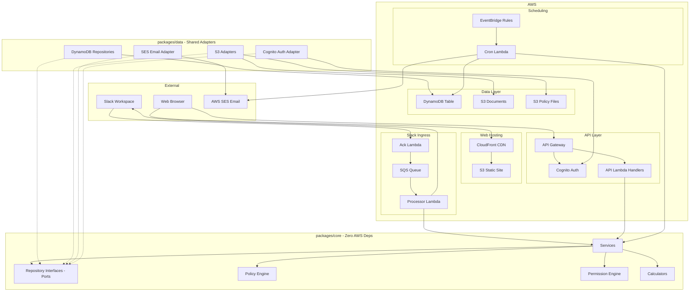
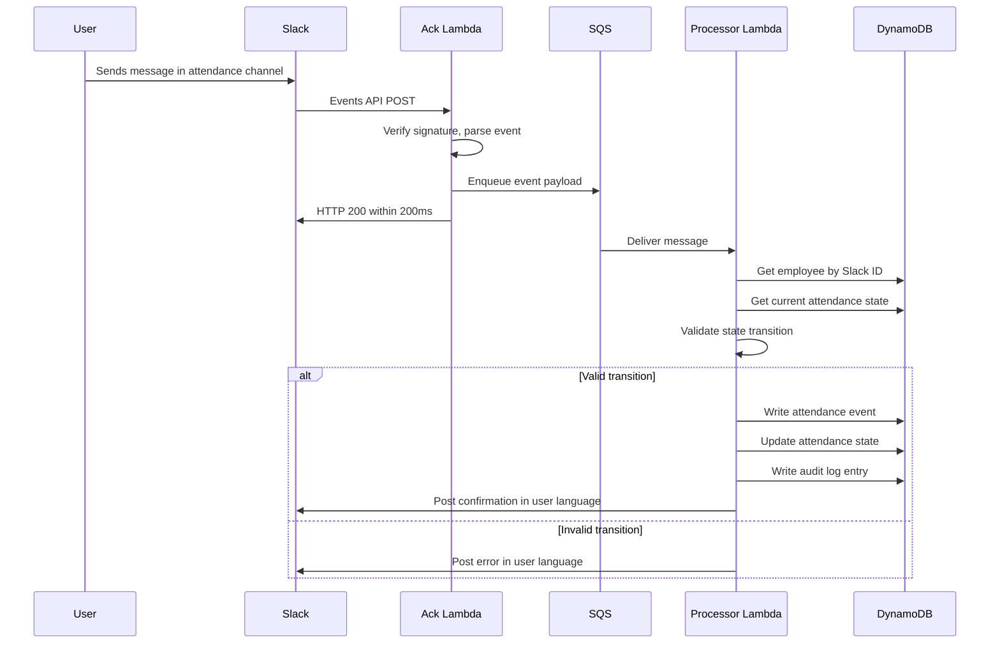
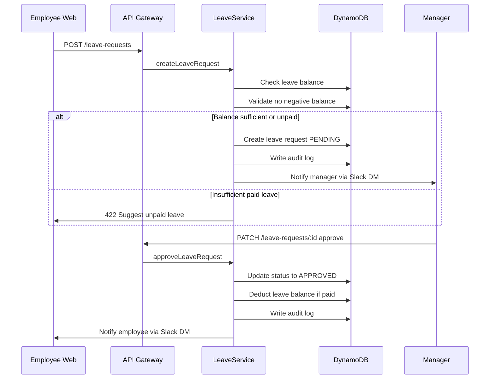
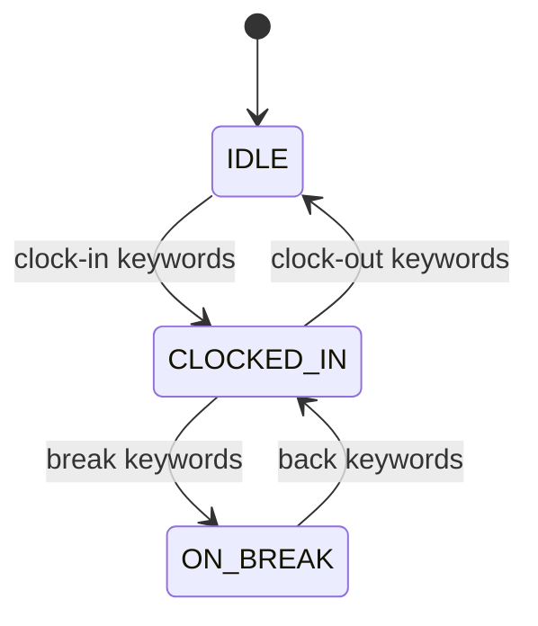
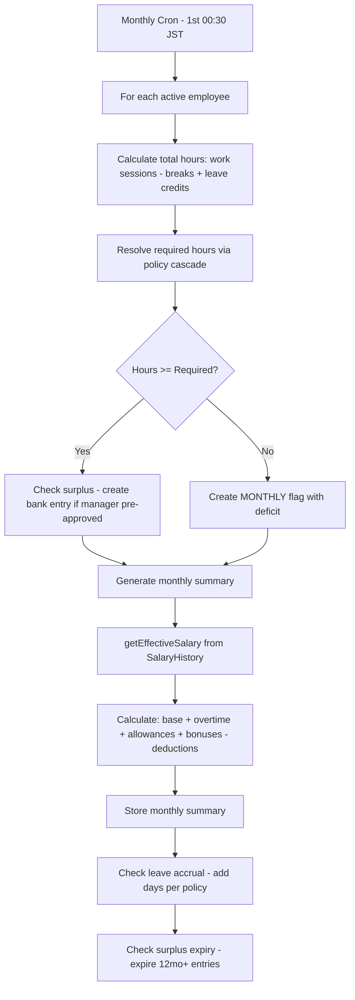
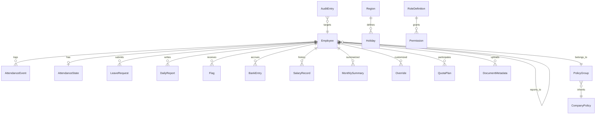

# Technical Design — WillDesign HR Platform

## Overview

**Purpose**: This platform delivers a full-stack HR management system for WillDesign KK/GK, replacing the existing buggy Google Apps Script Slack bot with a proper web application backed by AWS. It serves two distinct teams under different legal frameworks: Japan (~10 members, Japanese labor law) and Nepal (~15 members, Nepal Contract Act 2056).

**Users**: All team members use Slack for daily attendance and reporting. Managers approve leave, resolve flags, and view team data scoped to direct reports. Admins handle onboarding/offboarding, policy management, payroll, and holiday calendars via the web app. The CEO (Super Admin) has unrestricted access.

**Impact**: Replaces Google Sheets + Apps Script with DynamoDB + Lambda + React. Introduces cascading policy engine, RBAC + ABAC permissions, append-only audit logs, and configurable employment types for both regions.

### Goals
- Kincone-style message-based Slack attendance and daily reporting for both teams
- Web-based management layer for all features beyond attendance/reporting
- Cascading policy engine (company → group → employee) with static JSON files, swappable to DB
- RBAC + ABAC permission system supporting custom roles
- Append-only audit trail for all mutations, optimized for future LLM analysis
- AWS free tier deployment (~$0-5/month for up to 20 users)
- Hexagonal Architecture with Handler → Service → Repository for vendor independence

### Non-Goals
- AI/Claude backend processing (v1 uses regex only for JIRA/GitHub references)
- Social insurance and tax withholding calculations (handled externally in v1)
- JIRA/GitHub API cross-verification of daily reports (phase 2)
- SaaS multi-tenancy (single-tenant for WillDesign only)
- Mobile native app (web responsive only)
- Auto-close of unclosed attendance sessions (admin resolves manually)

## Architecture

> Discovery notes and full trade-off analysis available in `research.md`. All decisions restated here for self-contained review.

### Architecture Pattern & Boundary Map

**Selected pattern**: Hexagonal Architecture (Ports & Adapters) — core business logic defines repository interfaces (ports) with zero AWS dependencies. Infrastructure provides DynamoDB/S3/SES implementations (adapters). Swapping database or cloud provider requires only new adapter implementations.

**Domain boundaries**:
- **Slack Domain**: Event reception, keyword parsing, state machine, bot responses
- **Core Domain**: Policy engine, permission engine, calculators (hours, overtime, payroll, leave), services, repository interfaces (ports)
- **Data Domain**: DynamoDB/S3/SES repository implementations (adapters) — shared by API and Slack
- **API Domain**: REST handlers, authentication middleware, composition root
- **Web Domain**: React UI, client-side state, i18n, WillDesign brand theme
- **Infrastructure Domain**: CDK stacks, DynamoDB tables, Cognito, SES, EventBridge, SQS



**Key decisions**:
- `packages/core` has zero AWS imports — pure TypeScript business logic
- Repository interfaces (ports) defined in core; DynamoDB adapters in api/slack packages
- Lambda handlers are thin composition roots: instantiate adapters, inject into services, delegate
- Policy files stored in S3 (not Lambda filesystem) for persistence across invocations
- `packages/data/` contains all AWS adapter implementations, shared by both `api` and `slack` packages
- `AuthProviderAdapter` (Cognito) used by OnboardingService/OffboardingService for user lifecycle

### Technology Stack

| Layer | Choice / Version | Role in Feature | Notes |
|-------|------------------|-----------------|-------|
| Runtime | Node.js 20 (TypeScript strict) | Lambda execution environment | Pinned to 20 — Bolt.js incompatible with Node 24 runtime |
| Frontend | React 18 + Vite 5 | SPA dashboard, admin panels, i18n | S3 + CloudFront hosting |
| UI i18n | react-i18next | Multi-language UI (en, ja, ne) | JSON translation files |
| Backend | AWS Lambda + API Gateway REST | REST API handlers | Free tier: 1M requests/month |
| Slack | @slack/bolt + AwsLambdaReceiver | Event handling, message parsing | Dual-Lambda pattern with SQS |
| Database | DynamoDB (single-table, 2 GSIs) | All persistent data | Free tier: 25GB perpetual |
| Auth | AWS Cognito (Lite tier) | User authentication, JWT tokens | Free: 10K MAU perpetual |
| File Storage | S3 | Policy JSONs, employee documents, web assets | Free tier: 5GB |
| Queue | SQS (Standard) | Slack event async processing | Free tier: 1M requests/month |
| Email | AWS SES | Salary statement emails | ~$0 at this scale |
| Scheduler | EventBridge | Cron jobs (daily/weekly/monthly) | Free tier included |
| IaC | AWS CDK (TypeScript) | Infrastructure as code | All stacks in infra/ |
| Testing | Vitest + Testing Library | TDD unit/integration/component tests | Workspace-level config |
| PWA | Vite PWA plugin + Workbox | Installable app, offline, push notifications | Service worker + manifest |
| Theme | CSS Custom Properties (design tokens) | WillDesign brand: black/white/cyan | Centralized in theme.css |
| CI/CD | GitHub Actions | Lint, typecheck, test, deploy | develop → dev, main → prod |

## System Flows

### Slack Attendance Flow (Message-Based)



### Leave Request Workflow



### Attendance State Machine



Valid: IDLE→CLOCKED_IN, CLOCKED_IN→IDLE, CLOCKED_IN→ON_BREAK, ON_BREAK→CLOCKED_IN. All others rejected with descriptive error including relevant timestamp. Multiple sessions per day allowed (after clock-out, can clock-in again). 60-second idempotency window prevents duplicate events.

### Monthly Payroll Calculation Flow



### Cron Job Schedule

| Trigger | Time | Lambda | Actions |
|---------|------|--------|---------|
| Daily | 23:55 JST | daily-cron | Flag unclosed sessions, daily shortfall flags, short session flags |
| Weekly | Monday 00:15 JST | weekly-cron | Weekly shortfall summary |
| Monthly | 1st 00:30 JST | monthly-cron | Monthly summary, payroll calc, surplus expiry, leave accrual |
| Every 4h | */4 hours | reminder-cron | Pending leave request reminders (>24h) |
| Configurable | Per team/group | report-reminder | Daily report submission reminders |
| Configurable | Per policy cascade | payment-alert | Payment deadline alerts to admin |
| Configurable | Per policy cascade | salary-email | Auto-send salary statement emails |

## Requirements Traceability

Requirement IDs mapped as N.M where N = section number from requirements.md.

| Req ID | REQ Code | Summary | Components | Interfaces | Flows |
|--------|----------|---------|------------|------------|-------|
| 1.1 | REQ-SLACK-001 | Clock-in keyword matching + bilingual reply | SlackEventRouter, AttendanceService, KeywordMatcher | AttendanceRepository, SlackResponder | Slack Attendance |
| 1.2 | REQ-SLACK-002 | Break-start keyword + reply | SlackEventRouter, AttendanceService | AttendanceRepository | Slack Attendance |
| 1.3 | REQ-SLACK-003 | Break-end keyword + reply | SlackEventRouter, AttendanceService | AttendanceRepository | Slack Attendance |
| 1.4 | REQ-SLACK-004 | Clock-out keyword + reply | SlackEventRouter, AttendanceService | AttendanceRepository | Slack Attendance |
| 1.5 | REQ-SLACK-005 | 200ms ack, async SQS processing | AckLambda, SQS, ProcessorLambda | — | Slack Attendance |
| 1.6 | REQ-SLACK-006 | Append-only audit for web edits | AuditService | AuditRepository | — |
| 1.7 | REQ-SLACK-007 | Configurable keyword mappings per language | KeywordMatcher | S3PolicyRepository | — |
| 1.8 | REQ-SLACK-008 | Single bot, channel-to-group mapping | SlackEventRouter, ChannelConfigService | ConfigRepository | — |
| 1.9 | REQ-SLACK-009 | User language preference, bot replies in user lang | UserPreferenceService, SlackResponder | EmployeeRepository | — |
| 1.10 | REQ-SLACK-010 | Language change via Slack command | LanguageHandler | EmployeeRepository | — |
| 1.11 | REQ-SLACK-011 | Help/guidebook ephemeral message | GuidebookHandler, SlackResponder | — | — |
| 1.12 | REQ-SLACK-012 | 3-state attendance machine enforcement | AttendanceStateMachine | AttendanceRepository | State Machine |
| 1.13 | REQ-SLACK-013 | Multiple sessions/breaks per day, hours calc | HoursCalculator | AttendanceRepository | — |
| 1.14 | REQ-SLACK-014 | 60s idempotency window | AttendanceService | AttendanceRepository | — |
| 1.15 | REQ-SLACK-015 | No personal data in public channels | SlackResponder | — | — |
| 2.1 | REQ-REPORT-001 | Parse daily report from Slack message | ReportParser, ReportService | ReportRepository | — |
| 2.2 | REQ-REPORT-002 | Extract JIRA/GitHub references, warn if missing | ReferenceExtractor | — | — |
| 2.3 | REQ-REPORT-003 | Versioned edits on message_changed | ReportService | ReportRepository | — |
| 2.4 | REQ-REPORT-004 | Append-only, structured references stored | ReportService | ReportRepository, AuditRepository | — |
| 2.5 | REQ-REPORT-005 | Missing report warnings, configurable reminder | CronService, SlackResponder | — | Cron |
| 2.6 | REQ-REPORT-006 | Future AI verification (not v1) | — | — | — |
| 3.1 | REQ-WEB-001 | Dashboard: status, hours, leave, overtime, actions | DashboardPage | API endpoints | — |
| 3.2 | REQ-WEB-002 | Employee self-service: edit, view, request | AttendancePage, LeavePage, ReportsPage, PayrollPage | API endpoints | — |
| 3.3 | REQ-WEB-003 | Manager: team hours, approvals, flags, banking | TeamPage | API endpoints | Leave Request |
| 3.4 | REQ-WEB-004 | Admin: onboard, offboard, policies, holidays, config | AdminPage | API endpoints | — |
| 3.5 | REQ-WEB-005 | i18n: en, ja, ne | react-i18next | Translation JSON files | — |
| 3.6 | REQ-WEB-006 | Policy builder UI | PolicyBuilderComponent | PolicyService API | — |
| 3.7 | REQ-WEB-007 | Team leave calendar | LeaveCalendarComponent | LeaveService API | — |
| 3.8 | REQ-WEB-008 | Payroll breakdown view | PayrollBreakdownComponent | PayrollService API | — |
| 4.1 | REQ-POL-001 | 3-level cascade: company → group → employee | PolicyResolver | PolicyRepository | — |
| 4.2 | REQ-POL-002 | Static JSON files as data source | S3PolicyRepository | S3 bucket | — |
| 4.3 | REQ-POL-003 | Pure function resolvePolicy | PolicyResolver | PolicyRepository | — |
| 4.4 | REQ-POL-004 | Swappable data source layer | PolicyRepository interface | — | — |
| 4.5 | REQ-POL-005 | Policy covers hours, leave, overtime, compensation, probation | PolicyTypes | — | — |
| 4.6 | REQ-POL-006 | Effective date versioning | PolicyResolver | PolicyRepository | — |
| 4.7 | REQ-POL-007 | Japanese labor law seed data | PolicySeeder | S3PolicyRepository | — |
| 5.1 | REQ-PERM-001 | RBAC: 5 default roles, editable | PermissionEngine | RoleRepository | — |
| 5.2 | REQ-PERM-002 | ABAC: role + reporting chain + ownership + sensitivity | PermissionEngine | EmployeeRepository | — |
| 5.3 | REQ-PERM-003 | Manager scoped to direct reports | PermissionEngine | EmployeeRepository | — |
| 5.4 | REQ-PERM-004 | Admin full access | PermissionEngine | — | — |
| 5.5 | REQ-PERM-005 | Super Admin override | PermissionEngine | — | — |
| 5.6 | REQ-PERM-006 | Multiple admins | RoleService | RoleRepository | — |
| 5.7 | REQ-PERM-007 | Custom roles with granular permissions | RoleService | RoleRepository | — |
| 5.8 | REQ-PERM-008 | No sensitive data in public Slack | SlackResponder | — | — |
| 5.9 | REQ-PERM-009 | Holiday calendar RBAC | PermissionEngine | — | — |
| 6.1 | REQ-EMP-001 | Japan employment types | EmployeeService, PolicyResolver | EmployeeRepository | — |
| 6.2 | REQ-EMP-002 | Nepal employment types | EmployeeService, PolicyResolver | EmployeeRepository | — |
| 6.3 | REQ-EMP-003 | Configurable employment types | AdminService | EmployeeRepository | — |
| 6.4 | REQ-EMP-004 | Employment type → policy group mapping | PolicyResolver | PolicyRepository | — |
| 7.1 | REQ-ATT-001 | UTC storage, local timezone display | AttendanceService | AttendanceRepository | — |
| 7.2 | REQ-ATT-002 | State transition enforcement | AttendanceStateMachine | — | State Machine |
| 7.3 | REQ-ATT-003 | Cross-midnight → clock-in date | HoursCalculator | — | — |
| 7.4 | REQ-ATT-004 | Hours = sessions - breaks + leave credits | HoursCalculator | AttendanceRepository, LeaveRepository | — |
| 7.5 | REQ-ATT-005 | Hours resolve via policy cascade | PolicyResolver | PolicyRepository | — |
| 7.6 | REQ-ATT-006 | Work location tracking per session | AttendanceService | AttendanceRepository | — |
| 7.7 | REQ-ATT-007 | Unclosed sessions flagged at 23:55 JST | CronService | AttendanceRepository | Cron |
| 7.8 | REQ-ATT-008 | Short sessions flagged for admin | CronService | AttendanceRepository | Cron |
| 7.9 | REQ-ATT-009 | Holiday work at 1.0x, emergency metadata tag | HoursCalculator, AttendanceService | AttendanceRepository | — |
| 8.1 | REQ-OT-001 | Track overtime for all applicable employees | OvertimeCalculator | AttendanceRepository | — |
| 8.2 | REQ-OT-002 | Deemed overtime flag when actual exceeds threshold | OvertimeCalculator, FlagService | FlagRepository | — |
| 8.3 | REQ-OT-003 | JP labor law overtime rates | OvertimeCalculator, PolicyResolver | — | — |
| 8.4 | REQ-OT-004 | 36 Agreement limit tracking and warnings | OvertimeCalculator | — | — |
| 8.5 | REQ-OT-005 | Overtime config via policy cascade | PolicyResolver | PolicyRepository | — |
| 9.1 | REQ-LEAVE-001 | Configurable leave types | LeaveService | LeaveRepository, PolicyRepository | — |
| 9.2 | REQ-LEAVE-002 | Leave accrual per policy cascade | LeaveAccrualCalculator | LeaveRepository | Cron |
| 9.3 | REQ-LEAVE-003 | Leave approval workflow | LeaveService | LeaveRepository | Leave Request |
| 9.4 | REQ-LEAVE-004 | Configurable termination rules | LeaveService, PolicyResolver | — | — |
| 9.5 | REQ-LEAVE-005 | JP-specific leave types | LeaveService | PolicyRepository | — |
| 9.6 | REQ-LEAVE-006 | Mandatory 5-day tracking for JP | LeaveService | LeaveRepository | — |
| 9.7 | REQ-LEAVE-007 | No negative balance enforcement | LeaveService | LeaveRepository | Leave Request |
| 10.1 | REQ-PAY-001 | getEffectiveSalary from SalaryHistory | PayrollCalculator | SalaryRepository | — |
| 10.2 | REQ-PAY-002 | Monthly, annual, hourly salary types | PayrollCalculator | SalaryRepository | — |
| 10.3 | REQ-PAY-003 | Cascading bonus configuration | PayrollCalculator, PolicyResolver | — | — |
| 10.4 | REQ-PAY-004 | Commission input for sales roles | PayrollService | PayrollRepository | — |
| 10.5 | REQ-PAY-005 | Configurable allowances | PayrollCalculator, PolicyResolver | — | — |
| 10.6 | REQ-PAY-006 | Nepal deductions: deficit x hourly, NPR rounding | PayrollCalculator | — | — |
| 10.7 | REQ-PAY-007 | JP social insurance external (phase 1) | PayrollService | — | — |
| 10.8 | REQ-PAY-008 | Pro-rata mid-month join/exit | PayrollCalculator | — | — |
| 10.9 | REQ-PAY-009 | Salary change audit trail | SalaryService | SalaryRepository, AuditRepository | — |
| 10.10 | REQ-PAY-010 | JPY for JP, NPR for NP | PayrollCalculator | — | — |
| 10.11 | REQ-PAY-011 | Non-JPY payment tracking with exchange rate | PayrollService | PayrollRepository | — |
| 10.12 | REQ-PAY-012 | Salary statement email via SES | EmailService | SESAdapter | — |
| 10.13 | REQ-PAY-013 | Scheduled salary emails | CronService, EmailService | SESAdapter | Cron |
| 10.14 | REQ-PAY-014 | Mid-month blended salary | PayrollCalculator | SalaryRepository | Payroll Calc |
| 10.15 | REQ-PAY-015 | Payment deadline cascading + alerts | CronService, PayrollService | PolicyRepository | Cron |
| 10.16 | REQ-PAY-016 | Payroll breakdown view | PayrollBreakdownComponent | PayrollService API | — |
| 11.1 | REQ-FLAG-001 | 3-level flags: daily, weekly, monthly | FlagService | FlagRepository | Cron |
| 11.2 | REQ-FLAG-002 | Monthly resolution options | FlagService | FlagRepository, BankRepository | — |
| 11.3 | REQ-FLAG-003 | Anti-double-penalty (monthly only deducts) | FlagService | — | — |
| 11.4 | REQ-FLAG-004 | Pre-approved absences suppress flags | FlagService | LeaveRepository | — |
| 11.5 | REQ-FLAG-005 | Flag rules configurable via policy | FlagService, PolicyResolver | PolicyRepository | — |
| 12.1 | REQ-BANK-001 | Manager pre-approval for banking | BankService | BankRepository | — |
| 12.2 | REQ-BANK-002 | 12-month expiry | BankService, CronService | BankRepository | Cron |
| 12.3 | REQ-BANK-003 | Not cashable, offset or leave only | BankService | — | — |
| 12.4 | REQ-BANK-004 | Past deductions final, no retroactive reversal | FlagService | — | — |
| 12.5 | REQ-BANK-005 | Unapproved surplus hidden from employee | BankService, PermissionEngine | BankRepository | — |
| 13.1 | REQ-FM-001 | Proportional adjustment, no deduction | ForceMAjeurService | OverrideRepository | — |
| 13.2 | REQ-FM-002 | 24h notification, 30-day termination clause | ForceMAjeurService | — | — |
| 14.1 | REQ-QUOTA-001 | Monthly redistribution, same salary | QuotaService | OverrideRepository | — |
| 14.2 | REQ-QUOTA-002 | Validate totals, warn if less, allow with ack | QuotaService | — | — |
| 14.3 | REQ-QUOTA-003 | Termination uses standard hours | QuotaService, PayrollCalculator | OverrideRepository | — |
| 15.1 | REQ-HOL-001 | Per-region holiday calendars | HolidayService | HolidayRepository | — |
| 15.2 | REQ-HOL-002 | JP holidays seeded, substitute holidays | HolidaySeeder | HolidayRepository | — |
| 15.3 | REQ-HOL-003 | NP holidays manual management | HolidayService | HolidayRepository | — |
| 15.4 | REQ-HOL-004 | Holidays reduce required hours | HoursCalculator, PolicyResolver | HolidayRepository | — |
| 16.1 | REQ-OB-001 | Admin onboarding creates full employee record | OnboardingService | EmployeeRepository, SalaryRepository | — |
| 16.2 | REQ-OB-002 | Offboarding with settlement preview | OffboardingService | PayrollCalculator | — |
| 16.3 | REQ-OB-003 | Inactive employees cannot use system | PermissionEngine | EmployeeRepository | — |
| 16.4 | REQ-OB-004 | Post-termination date tracking | OffboardingService | EmployeeRepository | — |
| 16.5 | REQ-OB-005 | Document upload to S3 | DocumentService | S3DocumentRepository | — |
| 16.6 | REQ-OB-006 | Document verification status (PENDING/VERIFIED/REJECTED) | DocumentService | DocumentRepository, AuditRepository | — |
| 16.7 | REQ-OB-007 | Signed agreement linked to salary history | SalaryService | SalaryRepository, S3DocumentRepository | — |
| 16.8 | REQ-OB-008 | Termination type + cure period tracking | OffboardingService | EmployeeRepository | — |
| 17.1 | REQ-PROB-001 | Cascading probation duration | PolicyResolver | PolicyRepository | — |
| 17.2 | REQ-PROB-002 | Probation-specific rules | PolicyResolver, LeaveService | — | — |
| 17.3 | REQ-PROB-003 | Probation expiry alert 14 days before end | CronService | EmployeeRepository | Cron |
| 18.1 | REQ-AUDIT-001 | Append-only audit log with before/after | AuditService | AuditRepository | — |
| 18.2 | REQ-AUDIT-002 | Admin audit trail view | AuditService | AuditRepository | — |
| 18.3 | REQ-AUDIT-003 | Dual record for Slack + web edits | AuditService | AuditRepository | — |
| 18.4 | REQ-AUDIT-004 | LLM-ready structured data | AuditRepository | DynamoDB schema | — |
| 19.1 | REQ-INFRA-001 | Monorepo: api, web, slack, core, data, types, infra | Package structure | — | — |
| 19.2 | REQ-INFRA-002 | GitHub Actions CI/CD | ci.yml, deploy-dev.yml, deploy-prod.yml | — | — |
| 19.3 | REQ-INFRA-003 | AWS free tier ~$0-5/month | CDK stacks | — | — |
| 19.4 | REQ-INFRA-004 | TypeScript strict mode | tsconfig.base.json | — | — |
| 19.5 | REQ-INFRA-005 | TDD approach | Vitest configuration | — | — |
| 19.6 | REQ-INFRA-006 | Dev + prod environments | CDK environment config | — | — |
| 19.7 | REQ-INFRA-007 | Infrastructure as code (CDK) | infra/ package | — | — |
| 20.1-20.7 | REQ-CRON-* | Scheduled tasks (daily/weekly/monthly/alerts/emails) | CronService, EventBridge | Lambda handlers | Cron |
| 21.1 | REQ-SCALE-001 | Support 100+ users | DynamoDB auto-scaling, Lambda concurrency | — | — |
| 21.2 | REQ-SCALE-002 | Configurable without code changes | PolicyEngine, AdminService | PolicyRepository, RoleRepository | — |
| 21.3 | REQ-SCALE-003 | New regions without schema migration | DynamoDB schema with region attribute | — | — |
| 22.1 | REQ-THEME-001 | WillDesign brand color palette | ThemeProvider, theme.css | CSS custom properties | — |
| 22.2 | REQ-THEME-002 | Brand typography (Silom + system sans) | ThemeProvider, theme.css | CSS font declarations | — |
| 22.3 | REQ-THEME-003 | WillDesign logo in header/sidebar | AppLayout, HeaderComponent | Static asset | — |
| 22.4 | REQ-THEME-004 | Light, modern, minimalist aesthetic | All web components | ThemeProvider | — |
| 22.5 | REQ-THEME-005 | CSS design tokens (custom properties) | theme.css | All components via tokens | — |
| 22.6 | REQ-THEME-006 | Responsive breakpoints (mobile/tablet/desktop) | All web components | CSS breakpoints | — |
| 22.7 | REQ-THEME-007 | PWA: installable, offline, push notifications | ServiceWorker, WebManifest, PushService | — | — |
| 22.8 | REQ-THEME-008 | Mobile employee workflows (quick clock, leave, balance) | DashboardPage, MobileAttendanceWidget | API endpoints | — |
| 22.9 | REQ-THEME-009 | Mobile manager workflows (approve, flags, team view) | TeamPage, MobileApprovalWidget | API endpoints | — |

## Components and Interfaces

### Component Summary

| Component | Domain/Layer | Intent | Req Coverage | Key Dependencies | Contracts |
|-----------|-------------|--------|--------------|------------------|-----------|
| AttendanceStateMachine | Core/Logic | Enforce 3-state attendance transitions | 1.12, 7.2 | — | Service |
| KeywordMatcher | Core/Logic | Match Slack messages to attendance actions | 1.1-1.4, 1.7 | — | Service |
| HoursCalculator | Core/Calculator | Calculate daily/weekly/monthly hours | 1.13, 7.3, 7.4, 15.4 | AttendanceRepository, HolidayRepository | Service |
| OvertimeCalculator | Core/Calculator | Track overtime, deemed vs actual, 36 Agreement | 8.1-8.5 | PolicyRepository | Service |
| PayrollCalculator | Core/Calculator | Salary resolution, deductions, pro-rata, blending | 10.1-10.16 | SalaryRepository, PolicyRepository | Service |
| LeaveAccrualCalculator | Core/Calculator | Leave balance, accrual, carry-over | 9.1-9.7 | PolicyRepository | Service |
| PolicyResolver | Core/Policy | 3-level cascade deep merge | 4.1-4.7 | PolicyRepository | Service |
| PermissionEngine | Core/Permission | RBAC + ABAC authorization | 5.1-5.9, 16.3 | RoleRepository, EmployeeRepository | Service |
| AttendanceService | Core/Service | Attendance operations orchestration | 1.1-1.6, 7.1-7.8 | AttendanceRepository, AuditRepository | Service |
| LeaveService | Core/Service | Leave request lifecycle | 9.1-9.7 | LeaveRepository, AuditRepository | Service |
| PayrollService | Core/Service | Payroll orchestration, commission, allowances | 10.1-10.16 | PayrollRepository, SalaryRepository | Service |
| FlagService | Core/Service | Flag generation, resolution, anti-double-penalty | 11.1-11.5, 12.4 | FlagRepository, BankRepository | Service |
| BankService | Core/Service | Hours banking, approval, expiry, offset | 12.1-12.5 | BankRepository | Service |
| ReportService | Core/Service | Daily report CRUD, versioning | 2.1-2.5 | ReportRepository, AuditRepository | Service |
| OnboardingService | Core/Service | Employee creation, initial setup | 16.1-16.2 | EmployeeRepository, SalaryRepository | Service |
| OffboardingService | Core/Service | Settlement preview, deactivation | 16.2-16.4 | PayrollCalculator, EmployeeRepository | Service |
| AuditService | Core/Service | Append-only audit log management | 18.1-18.4 | AuditRepository | Service |
| QuotaService | Core/Service | Redistribution plans, override management | 14.1-14.3 | OverrideRepository | Service |
| HolidayService | Core/Service | Holiday CRUD per region | 15.1-15.4 | HolidayRepository | Service |
| EmailService | Core/Service | Email template rendering, sending | 10.12-10.13 | EmailAdapter (port) | Service |
| RoleService | Core/Service | Custom role CRUD, permission assignment | 5.1, 5.6, 5.7 | RoleRepository | Service |
| CronService | Core/Service | Orchestrate scheduled jobs | 20.1-20.7, 7.7-7.8 | Multiple repositories | Service |
| DynamoDBRepositories | Data/Adapter | DynamoDB implementations of all repository ports | All | AWS SDK DynamoDB | API |
| S3PolicyRepository | Data/Adapter | Read/write policy JSON files from S3 | 4.2 | AWS SDK S3 | API |
| S3DocumentRepository | Data/Adapter | Employee document upload/download | 16.5 | AWS SDK S3 | API |
| SESEmailAdapter | Data/Adapter | Send emails via AWS SES | 10.12 | AWS SDK SES | API |
| CognitoAuthAdapter | Data/Adapter | Cognito user lifecycle (create/disable/delete) | 16.1, 16.2 | AWS SDK Cognito | API |
| API Handlers | API/Handler | Thin Lambda handlers, composition root | All API | Services, Data Adapters | API |
| Slack Handlers | Slack/Handler | Ack + process Slack events | 1.1-1.15, 2.1-2.5 | Services, Data Adapters | Event |
| SlackResponder | Slack/Adapter | Post messages via Slack API | 1.1-1.4, 1.11, 1.15 | @slack/web-api | API |
| ThemeProvider | Web/UI | WillDesign brand design tokens and CSS custom properties | 22.1-22.6 | theme.css | State |
| PWAShell | Web/UI | Service worker, manifest, offline cache, push notifications | 22.7-22.9 | ServiceWorker, WebManifest | State |
| Web Pages | Web/UI | React pages and components | 3.1-3.8 | API endpoints, ThemeProvider | State |

### Core / Logic Layer

#### AttendanceStateMachine

| Field | Detail |
|-------|--------|
| Intent | Validate and enforce attendance state transitions (IDLE, CLOCKED_IN, ON_BREAK) |
| Requirements | 1.12, 7.2 |

**Responsibilities & Constraints**
- Pure function: takes current state + action, returns new state or error
- No side effects, no DB access — receives state as input
- Enforces valid transitions only; rejects with descriptive error including timestamp

**Contracts**: Service [x]

```typescript
type AttendanceState = 'IDLE' | 'CLOCKED_IN' | 'ON_BREAK';
type AttendanceAction = 'CLOCK_IN' | 'CLOCK_OUT' | 'BREAK_START' | 'BREAK_END';

interface TransitionResult {
  success: true;
  newState: AttendanceState;
} | {
  success: false;
  error: string;
  currentState: AttendanceState;
  lastEventTimestamp: string;
}

function validateTransition(
  currentState: AttendanceState,
  action: AttendanceAction,
  lastEventTimestamp: string
): TransitionResult;
```

#### KeywordMatcher

| Field | Detail |
|-------|--------|
| Intent | Match incoming Slack message text to attendance actions using configurable keyword maps |
| Requirements | 1.1-1.4, 1.7 |

**Contracts**: Service [x]

```typescript
interface KeywordConfig {
  readonly language: 'en' | 'ja';
  readonly mappings: Record<AttendanceAction, readonly string[]>;
}

interface MatchResult {
  matched: true;
  action: AttendanceAction;
  keyword: string;
} | {
  matched: false;
}

function matchKeyword(
  messageText: string,
  configs: readonly KeywordConfig[]
): MatchResult;
```

#### PolicyResolver

| Field | Detail |
|-------|--------|
| Intent | Resolve effective policy via 3-level cascade deep merge: company → group → employee |
| Requirements | 4.1-4.7 |

**Responsibilities & Constraints**
- Pure function with no side effects
- Deep merge: lower levels override higher levels field-by-field
- Supports effective_from date versioning
- Data source injected via PolicyRepository interface

**Dependencies**
- Inbound: All services needing policy data (P0)
- Outbound: PolicyRepository — load policy data (P0)

**Contracts**: Service [x]

```typescript
interface EffectivePolicy {
  readonly hours: HoursPolicy;
  readonly leave: LeavePolicy;
  readonly overtime: OvertimePolicy;
  readonly compensation: CompensationPolicy;
  readonly probation: ProbationPolicy;
  readonly workArrangement: WorkArrangementPolicy;
  readonly flags: FlagPolicy;
}

interface PolicyResolver {
  resolvePolicy(userId: string, effectiveDate: Date): Promise<EffectivePolicy>;
  resolveGroupPolicy(groupName: string, effectiveDate: Date): Promise<EffectivePolicy>;
}
```

#### PermissionEngine

| Field | Detail |
|-------|--------|
| Intent | RBAC + ABAC authorization decisions combining role hierarchy and attribute rules |
| Requirements | 5.1-5.9 |

**Responsibilities & Constraints**
- RBAC: check role hierarchy (Employee < Manager < HR Manager < Admin < Super Admin)
- ABAC: evaluate reporting chain (manager_id), resource ownership, data sensitivity
- Custom roles: check granular permission sets
- Pure decision function — context provided by caller

**Contracts**: Service [x]

```typescript
type Role = 'EMPLOYEE' | 'MANAGER' | 'HR_MANAGER' | 'ADMIN' | 'SUPER_ADMIN' | string;

interface AuthContext {
  readonly actorId: string;
  readonly actorRole: Role;
  readonly actorCustomPermissions: readonly string[];
}

interface ResourceContext {
  readonly resourceType: string;
  readonly resourceOwnerId: string;
  readonly ownerManagerId: string;
  readonly sensitivityLevel: 'PUBLIC' | 'INTERNAL' | 'SENSITIVE' | 'CONFIDENTIAL';
}

interface AuthorizationResult {
  allowed: boolean;
  reason: string;
}

interface PermissionEngine {
  authorize(
    actor: AuthContext,
    action: string,
    resource: ResourceContext
  ): AuthorizationResult;

  hasPermission(actor: AuthContext, permission: string): boolean;
}
```

### Core / Calculator Layer

#### HoursCalculator

| Field | Detail |
|-------|--------|
| Intent | Calculate daily/weekly/monthly worked hours from attendance events |
| Requirements | 1.13, 7.3, 7.4, 15.4 |

**Contracts**: Service [x]

```typescript
interface HoursBreakdown {
  readonly workedHours: number;
  readonly breakHours: number;
  readonly leaveCredits: number;
  readonly totalHours: number;
  readonly sessions: readonly SessionSummary[];
}

interface HoursCalculator {
  calculateDaily(events: readonly AttendanceEvent[], leaveCredits: number): HoursBreakdown;
  calculateWeekly(employeeId: string, weekStart: Date): Promise<HoursBreakdown>;
  calculateMonthly(employeeId: string, yearMonth: string): Promise<HoursBreakdown>;
}
```

- Cross-midnight: all hours count toward clock-in date
- Holidays reduce required hours (fetched from HolidayRepository)

#### PayrollCalculator

| Field | Detail |
|-------|--------|
| Intent | Compute monthly payroll: base salary, overtime, allowances, bonuses, deductions, pro-rata, blending |
| Requirements | 10.1-10.16 |

**Contracts**: Service [x]

```typescript
interface PayrollBreakdown {
  readonly baseSalary: number;
  readonly proRataAdjustment: number;
  readonly overtimePay: number;
  readonly allowances: readonly AllowanceItem[];
  readonly bonus: number;
  readonly commission: number;
  readonly deficitDeduction: number;
  readonly blendingDetails: BlendingDetails | null;
  readonly transferFees: number;
  readonly netAmount: number;
  readonly currency: 'JPY' | 'NPR';
  readonly jpyEquivalent: number | null;
  readonly exchangeRate: number | null;
}

interface PayrollCalculator {
  getEffectiveSalary(employeeId: string, yearMonth: string): Promise<SalaryRecord>;
  calculateMonthlyPayroll(employeeId: string, yearMonth: string): Promise<PayrollBreakdown>;
  calculateProRata(salary: number, daysWorked: number, totalDays: number): number;
  calculateBlendedSalary(entries: readonly SalaryRecord[], yearMonth: string): number;
}
```

- `getEffectiveSalary()` reads from SalaryHistory, never current salary directly
- Deduction rounding: ceiling to nearest whole unit (NPR/JPY)
- Mid-month blending: `(old × days_at_old / total) + (new × days_at_new / total)`

### Core / Service Layer

#### AttendanceService

| Field | Detail |
|-------|--------|
| Intent | Orchestrate attendance operations: validate, persist, audit |
| Requirements | 1.1-1.6, 7.1-7.8 |

**Dependencies**
- Outbound: AttendanceRepository (P0), AuditRepository (P0), EmployeeRepository (P0)

**Contracts**: Service [x]

```typescript
interface AttendanceService {
  processAttendanceEvent(
    employeeId: string,
    action: AttendanceAction,
    timestamp: Date,
    source: 'slack' | 'web',
    actorId: string
  ): Promise<Result<AttendanceEvent, AttendanceError>>;

  getCurrentState(employeeId: string): Promise<AttendanceState>;
  getEventsForDate(employeeId: string, date: string): Promise<readonly AttendanceEvent[]>;
  getEventsForMonth(employeeId: string, yearMonth: string): Promise<readonly AttendanceEvent[]>;
  editAttendance(employeeId: string, eventId: string, updates: AttendanceEdit, actorId: string): Promise<Result<AttendanceEvent, AttendanceError>>;
}
```

- 60-second idempotency: reject duplicate events from same user within window
- All mutations create audit log entries with before/after values

#### LeaveService

| Field | Detail |
|-------|--------|
| Intent | Leave request lifecycle: create, approve, reject, balance tracking |
| Requirements | 9.1-9.7 |

**Contracts**: Service [x]

```typescript
interface LeaveService {
  createRequest(employeeId: string, request: LeaveRequestInput): Promise<Result<LeaveRequest, LeaveError>>;
  approveRequest(requestId: string, managerId: string, leaveType: LeaveType): Promise<Result<LeaveRequest, LeaveError>>;
  rejectRequest(requestId: string, managerId: string, reason: string): Promise<Result<LeaveRequest, LeaveError>>;
  getBalance(employeeId: string): Promise<LeaveBalance>;
  getMandatoryUsageStatus(employeeId: string, year: number): Promise<MandatoryLeaveStatus>;
}
```

- No-negative-balance enforcement: reject paid leave if balance = 0, suggest unpaid/shift
- JP mandatory 5-day tracking: warn when insufficient days taken

#### FlagService

| Field | Detail |
|-------|--------|
| Intent | Generate and resolve shortfall flags at daily/weekly/monthly levels |
| Requirements | 11.1-11.5, 12.4 |

**Contracts**: Service [x]

```typescript
type FlagResolution = 'NO_PENALTY' | 'DEDUCT_FULL' | 'USE_BANK' | 'PARTIAL_BANK' | 'DISCUSS';

interface FlagService {
  generateDailyFlags(date: string): Promise<readonly Flag[]>;
  generateWeeklyFlags(weekStart: string): Promise<readonly Flag[]>;
  generateMonthlyFlags(yearMonth: string): Promise<readonly Flag[]>;
  resolveFlag(flagId: string, resolution: FlagResolution, managerId: string, bankOffsetHours?: number): Promise<Result<Flag, FlagError>>;
}
```

- Anti-double-penalty: only monthly flags result in salary deductions
- Pre-approved absences suppress flag generation
- Bank offset: manager can apply banked surplus to reduce/eliminate deficit

### Core / Repository Interfaces (Ports)

All repository interfaces defined in `packages/core/repositories/`. Zero AWS imports. Implementations provided by adapter packages.

```typescript
interface EmployeeRepository {
  findById(id: string): Promise<Employee | null>;
  findBySlackId(slackId: string): Promise<Employee | null>;
  findByManagerId(managerId: string): Promise<readonly Employee[]>;
  findAll(options?: { status?: EmployeeStatus }): Promise<readonly Employee[]>;
  create(employee: CreateEmployeeInput): Promise<Employee>;
  update(id: string, updates: UpdateEmployeeInput): Promise<Employee>;
}

interface AttendanceRepository {
  getState(employeeId: string): Promise<AttendanceStateRecord>;
  saveState(employeeId: string, state: AttendanceStateRecord): Promise<void>;
  saveEvent(event: AttendanceEvent): Promise<void>;
  getEventsForDate(employeeId: string, date: string): Promise<readonly AttendanceEvent[]>;
  getEventsForMonth(employeeId: string, yearMonth: string): Promise<readonly AttendanceEvent[]>;
  getUnclosedSessions(date: string): Promise<readonly AttendanceStateRecord[]>;
}

interface LeaveRepository {
  create(request: LeaveRequest): Promise<LeaveRequest>;
  findById(id: string): Promise<LeaveRequest | null>;
  findByEmployee(employeeId: string, options?: LeaveQueryOptions): Promise<readonly LeaveRequest[]>;
  findPending(): Promise<readonly LeaveRequest[]>;
  update(id: string, updates: Partial<LeaveRequest>): Promise<LeaveRequest>;
}

interface SalaryRepository {
  getHistory(employeeId: string): Promise<readonly SalaryRecord[]>;
  getEffective(employeeId: string, yearMonth: string): Promise<SalaryRecord | null>;
  addEntry(entry: SalaryRecord): Promise<SalaryRecord>;
}

interface ReportRepository {
  save(report: DailyReport): Promise<DailyReport>;
  findByEmployeeAndDate(employeeId: string, date: string): Promise<readonly DailyReport[]>;
  findLatestVersion(employeeId: string, date: string): Promise<DailyReport | null>;
}

interface FlagRepository {
  save(flag: Flag): Promise<Flag>;
  findByEmployee(employeeId: string, options?: FlagQueryOptions): Promise<readonly Flag[]>;
  findPending(): Promise<readonly Flag[]>;
  update(id: string, updates: Partial<Flag>): Promise<Flag>;
}

interface BankRepository {
  save(entry: BankEntry): Promise<BankEntry>;
  findByEmployee(employeeId: string, options?: BankQueryOptions): Promise<readonly BankEntry[]>;
  findActive(employeeId: string): Promise<readonly BankEntry[]>;
  update(id: string, updates: Partial<BankEntry>): Promise<BankEntry>;
}

interface AuditRepository {
  append(entry: AuditEntry): Promise<void>;
  findByTarget(targetId: string, options?: AuditQueryOptions): Promise<readonly AuditEntry[]>;
  findByActor(actorId: string, options?: AuditQueryOptions): Promise<readonly AuditEntry[]>;
}

interface HolidayRepository {
  findByRegionAndYear(region: string, year: number): Promise<readonly Holiday[]>;
  save(holiday: Holiday): Promise<Holiday>;
  delete(region: string, date: string): Promise<void>;
}

interface OverrideRepository {
  findByEmployee(employeeId: string, periodType: PeriodType, periodValue: string): Promise<Override | null>;
  save(override: Override): Promise<Override>;
}

interface PolicyRepository {
  getCompanyPolicy(): Promise<RawPolicy>;
  getGroupPolicy(groupName: string): Promise<RawPolicy | null>;
  getUserPolicy(userId: string): Promise<RawPolicy | null>;
  saveGroupPolicy(groupName: string, policy: RawPolicy): Promise<void>;
  saveUserPolicy(userId: string, policy: RawPolicy): Promise<void>;
}

interface RoleRepository {
  findByName(name: string): Promise<RoleDefinition | null>;
  findAll(): Promise<readonly RoleDefinition[]>;
  save(role: RoleDefinition): Promise<RoleDefinition>;
  delete(name: string): Promise<void>;
}

interface MonthlySummaryRepository {
  findByEmployeeAndMonth(employeeId: string, yearMonth: string): Promise<MonthlySummary | null>;
  save(summary: MonthlySummary): Promise<MonthlySummary>;
}

interface DocumentRepository {
  save(metadata: DocumentMetadata): Promise<DocumentMetadata>;
  findByEmployee(employeeId: string): Promise<readonly DocumentMetadata[]>;
  getUploadUrl(employeeId: string, fileName: string): Promise<string>;
  getDownloadUrl(employeeId: string, documentId: string): Promise<string>;
}

interface EmailAdapter {
  sendEmail(to: string, subject: string, htmlBody: string): Promise<void>;
}

interface AuthProviderAdapter {
  createUser(input: CreateAuthUserInput): Promise<{ authUserId: string }>;
  disableUser(authUserId: string): Promise<void>;
  deleteUser(authUserId: string): Promise<void>;
  setTemporaryPassword(authUserId: string, tempPassword: string): Promise<void>;
  updateAttributes(authUserId: string, attributes: Record<string, string>): Promise<void>;
}

interface CreateAuthUserInput {
  readonly email: string;
  readonly employeeId: string;
  readonly role: string;
  readonly preferredLanguage: string;
}
```

### API / Handler Layer

API handlers are thin Lambda functions that serve as composition roots: instantiate repository adapters, inject into services, delegate to service methods, and return HTTP responses.

##### API Contract

| Method | Endpoint | Request | Response | Auth | Errors |
|--------|----------|---------|----------|------|--------|
| GET | /employees/me | — | Employee | Employee+ | 401 |
| GET | /employees/:id | — | Employee | Manager/Admin | 401, 403, 404 |
| GET | /employees | ?status=ACTIVE | Employee[] | Admin | 401, 403 |
| POST | /employees | CreateEmployeeInput | Employee | Admin | 401, 403, 400, 409 |
| PATCH | /employees/:id | UpdateEmployeeInput | Employee | Admin | 401, 403, 400, 404 |
| GET | /attendance/state | — | AttendanceState | Employee+ | 401 |
| GET | /attendance/events | ?date, ?month | AttendanceEvent[] | Employee+ | 401 |
| POST | /attendance/events | AttendanceEventInput | AttendanceEvent | Employee+ | 401, 400, 409 |
| PATCH | /attendance/events/:id | AttendanceEdit | AttendanceEvent | Employee+ | 401, 403, 400 |
| POST | /leave-requests | LeaveRequestInput | LeaveRequest | Employee+ | 401, 400, 422 |
| GET | /leave-requests | ?status, ?employee | LeaveRequest[] | Employee+ | 401 |
| PATCH | /leave-requests/:id | ApproveRejectInput | LeaveRequest | Manager+ | 401, 403, 400 |
| GET | /leave/balance | ?employeeId | LeaveBalance | Employee+ | 401 |
| GET | /reports | ?date, ?employee | DailyReport[] | Employee+ | 401 |
| POST | /reports | DailyReportInput | DailyReport | Employee+ | 401, 400 |
| GET | /payroll/:yearMonth | ?employeeId | PayrollBreakdown | Employee+ | 401, 403 |
| GET | /flags | ?status, ?period, ?employee | Flag[] | Manager+ | 401, 403 |
| PATCH | /flags/:id | FlagResolutionInput | Flag | Manager+ | 401, 403, 400 |
| GET | /bank | ?employeeId | BankEntry[] | Employee+ | 401 |
| POST | /bank/approve | BankApprovalInput | BankEntry | Manager+ | 401, 403 |
| GET | /holidays | ?region, ?year | Holiday[] | Employee+ | 401 |
| POST | /holidays | HolidayInput | Holiday | Admin/RBAC | 401, 403, 400 |
| DELETE | /holidays/:region/:date | — | — | Admin/RBAC | 401, 403, 404 |
| GET | /policies/:groupName | — | EffectivePolicy | Admin | 401, 403 |
| PUT | /policies/:groupName | RawPolicy | — | Admin | 401, 403, 400 |
| GET | /roles | — | RoleDefinition[] | Admin | 401, 403 |
| POST | /roles | RoleDefinitionInput | RoleDefinition | Admin | 401, 403, 400 |
| GET | /audit/:targetId | ?from, ?to | AuditEntry[] | Admin | 401, 403 |
| POST | /onboard | OnboardInput | Employee | Admin | 401, 403, 400 |
| POST | /offboard/:id | OffboardInput | SettlementPreview | Admin | 401, 403, 400 |
| POST | /documents/upload-url | UploadUrlRequest | { url: string } | Employee+ | 401 |
| GET | /documents | ?employeeId | DocumentMetadata[] | Employee+ | 401 |
| GET | /quota-plans | ?employeeId | QuotaPlan[] | Manager+ | 401, 403 |
| POST | /quota-plans | QuotaPlanInput | QuotaPlan | Manager+ | 401, 403, 400 |
| POST | /salary-emails/send | SendSalaryEmailInput | — | Admin | 401, 403 |

**Auth notation**: Employee+ = any authenticated user (scoped to own data), Manager+ = manager of target employee or admin, Admin = admin role only, Admin/RBAC = admin or role with specific permission.

**Implementation Notes**
- All handlers follow: parse request → check auth → check permissions → call service → format response
- Permission middleware calls PermissionEngine.authorize() before handler logic
- Cognito JWT token provides actorId and role claims
- All mutation endpoints trigger AuditService.append() via service layer

### Data / Adapter Layer (packages/data — Shared)

All adapter implementations live in `packages/data/`. Both `packages/api` and `packages/slack` depend on this package for data access. This resolves the shared adapter concern: neither api nor slack owns the adapters — they share them via a dedicated package.

**Package structure**: `data <- core, types` (contains DynamoDB, S3, SES, Cognito implementations)

**DynamoDB Repositories**:
- Implement all interfaces from `packages/core/repositories/` using AWS SDK v3 DynamoDBDocumentClient
- Single DynamoDBClient instance shared across repositories (injected at handler level)
- Use TransactWriteItems for multi-entity mutations (e.g., attendance event + state + audit)
- Idempotency via conditional writes (ConditionExpression)
- All timestamps stored as ISO 8601 UTC strings

**CognitoAuthAdapter**:
- Implements `AuthProviderAdapter` port from core
- Called by OnboardingService to create Cognito user with temp password + employee_id attribute
- Called by OffboardingService to disable Cognito user (preserves for audit)
- Maps employee role to Cognito group for JWT claim injection

**Policy File Lifecycle (S3PolicyRepository)**:
- **Initial deployment**: CDK deploys seed JSON files from git `policies/` folder to S3 bucket (only on first deploy or explicit seed command)
- **Runtime reads**: PolicyResolver reads from S3 via S3PolicyRepository — S3 is the runtime source of truth
- **Web policy builder writes**: Admin edits via API write directly to S3 — no git roundtrip needed
- **Redeployment safety**: CDK does NOT overwrite existing S3 policy files on redeploy (prevents wiping admin edits)
- **Git `policies/` folder**: Serves as seed data + documentation + version control baseline only

### Slack / Handler Layer

#### SlackEventRouter

| Field | Detail |
|-------|--------|
| Intent | Route incoming Slack events to appropriate handlers based on channel purpose and user profile |
| Requirements | 1.1-1.15, 2.1-2.5 |

**Responsibilities & Constraints**
- Ack Lambda: verify Slack signature, determine channel purpose (attendance/reporting/both), enqueue to SQS
- Processor Lambda: dequeue, look up user by Slack ID → employee profile (group, team, language, policy), route to AttendanceHandler or ReportHandler based on channel purpose
- Channel config stores **purpose only** (attendance/reporting/both), NOT team/group. A single channel can contain members from multiple teams and employment types
- User's group, team, region, language, and policy are always resolved from their **employee profile**, not from the channel
- This allows mixed-team channels (e.g., HR channel with both JP and NP members)

##### Event Contract
- Subscribed events: `message` (new messages), `message_changed` (edits for report versioning)
- Delivery: SQS Standard queue, at-least-once
- Idempotency: 60-second window for attendance, message_ts dedup for reports

### Web / UI Layer

Web pages are React components consuming the REST API. No direct core imports.

**Implementation Notes**
- Authentication: Cognito Hosted UI for login, JWT stored in memory (not localStorage)
- API calls: fetch wrapper with JWT Authorization header
- i18n: react-i18next with lazy-loaded JSON translation files (en.json, ja.json, ne.json)
- Routing: React Router v6 with role-based route guards
- State: React Query for server state, React Context for auth/i18n

Key pages: DashboardPage (3.1), AttendancePage (3.2), LeavePage (3.2, 3.7), ReportsPage (3.2), PayrollPage (3.2, 3.8), TeamPage (3.3), AdminPage (3.4, 3.6), SettingsPage.

#### ThemeProvider & Brand System

| Field | Detail |
|-------|--------|
| Intent | Provide WillDesign brand identity as CSS design tokens consumed by all components |
| Requirements | 22.1-22.6 |

**Design Tokens** (CSS Custom Properties in `theme.css`):
```css
:root {
  /* Brand Colors */
  --wd-color-primary: #000000;
  --wd-color-accent: #58C2D9;
  --wd-color-accent-light: #6DD9EC;
  --wd-color-accent-gradient: linear-gradient(0deg, #58C2D9 24%, #6DD9EC 93%);
  --wd-color-background: #FFFFFF;
  --wd-color-surface: #F8F9FA;
  --wd-color-text: #000000;
  --wd-color-text-secondary: #32373C;
  --wd-color-text-muted: #888888;
  --wd-color-border: #DDDDDD;
  --wd-color-shadow: #D9D9D9;

  /* Semantic Colors */
  --wd-color-success: #40DEC5;
  --wd-color-info: #73A5DC;
  --wd-color-warning: #E2498A;
  --wd-color-error: #E2498A;
  --wd-color-hover: #4BB8DF;
  --wd-color-focus: #5636D1;

  /* Data Visualization */
  --wd-color-chart-1: #58C2D9;
  --wd-color-chart-2: #40DEC5;
  --wd-color-chart-3: #73A5DC;
  --wd-color-chart-4: #8C89E8;
  --wd-color-chart-5: #E2498A;

  /* Typography */
  --wd-font-heading: "Silom", sans-serif;
  --wd-font-body: -apple-system, BlinkMacSystemFont, "Segoe UI", Roboto, "Helvetica Neue", Arial, sans-serif;
  --wd-font-mono: "SF Mono", "Fira Code", monospace;

  /* Spacing & Layout */
  --wd-radius-sm: 4px;
  --wd-radius-md: 8px;
  --wd-radius-lg: 12px;
  --wd-transition: 150ms ease-in-out;
}
```

**Brand Assets**:
- Logo file: `will-design-logo.png` in `public/assets/`
- Logo placement: top-left of sidebar/header, links to dashboard
- Favicon: extracted from logo

**Responsive Breakpoints**:
- Mobile: `< 640px` (single column, bottom nav)
- Tablet: `640px - 1024px` (collapsible sidebar)
- Desktop: `> 1024px` (full sidebar + content)

**Aesthetic Rules**:
- Light theme only (matches willdesign-tech.com)
- High contrast: black text on white, cyan/teal for interactive elements
- Generous whitespace, clean card-based layouts
- Smooth transitions (150ms ease) on hover/focus states
- No rounded-everything — subtle radii (4-12px) for professional feel

## Data Models

### Domain Model



**Aggregates**:
- **Employee** (root): Profile, attendance state, leave balance, salary history
- **AttendanceSession**: Events within a clock-in/clock-out cycle
- **LeaveRequest**: Request lifecycle (PENDING → APPROVED/REJECTED)
- **Flag**: Shortfall detection lifecycle (PENDING → resolved)
- **Policy**: Company → Group → User cascade hierarchy
- **AuditEntry**: Immutable, append-only

**Business Rules & Invariants**:
- Leave balance never goes negative
- Attendance state machine: only valid transitions allowed
- Salary history is append-only — no edits, no deletes
- Monthly flag is the only flag level that triggers deductions
- Past deductions are final — no retroactive reversal from future surplus
- getEffectiveSalary() always reads from SalaryHistory, never current salary field

### Logical Data Model

**DynamoDB Single-Table Design**

One table (`willdesign-hr`) with two Global Secondary Indexes.

**Base Table**: PK (String), SK (String)
**GSI1**: GSI1PK (String), GSI1SK (String) — reverse/status lookups
**GSI2**: GSI2PK (String), GSI2SK (String) — org-wide admin queries

#### Entity Key Patterns

| Entity | PK | SK | GSI1PK | GSI1SK | GSI2PK | GSI2SK |
|--------|----|----|--------|--------|--------|--------|
| Employee Profile | `EMP#<id>` | `PROFILE` | `SLACK#<slack_id>` | `EMP#<id>` | `ORG#EMP` | `STATUS#<status>#<id>` |
| Legal Obligation | `EMP#<id>` | `LEGAL#<type>` | — | — | `ORG#LEGAL` | `EXPIRY#<date>#<id>` |
| Employee-Manager | `EMP#<id>` | `MGR` | `MGR#<manager_id>` | `EMP#<id>` | — | — |
| Attendance Event | `EMP#<id>` | `ATT#<date>#<ts>` | — | — | `ORG#ATT#<date>` | `EMP#<id>#<ts>` |
| Attendance State | `EMP#<id>` | `ATT_STATE` | — | — | — | — |
| Leave Request | `EMP#<id>` | `LEAVE#<id>` | `LEAVE#<status>` | `<date>#<id>` | `ORG#LEAVE` | `DATE#<date>#<id>` |
| Daily Report | `EMP#<id>` | `REPORT#<date>#v<ver>` | — | — | `ORG#REPORT#<date>` | `EMP#<id>` |
| Flag | `EMP#<id>` | `FLAG#<type>#<period>` | `FLAG#<status>` | `<period>#EMP#<id>` | — | — |
| Hours Bank | `EMP#<id>` | `BANK#<period>` | — | — | — | — |
| Salary Record | `EMP#<id>` | `SALARY#<eff_date>` | — | — | — | — |
| Monthly Summary | `EMP#<id>` | `MONTH#<yyyy-mm>` | — | — | — | — |
| Holiday | `REGION#<region>` | `HOL#<yyyy-mm-dd>` | — | — | `ORG#HOLIDAY` | `<yyyy>#<region>` |
| Audit Entry | `AUDIT#<target_id>` | `<timestamp>#<uuid>` | `AUDIT_ACTOR#<actor_id>` | `<timestamp>` | — | — |
| Quota Plan | `EMP#<id>` | `QUOTA#<plan_id>` | — | — | — | — |
| Override | `EMP#<id>` | `OVR#<type>#<value>` | — | — | — | — |
| Document | `EMP#<id>` | `DOC#<id>` | — | — | — | — |
| Role | `ROLE#<name>` | `DEFINITION` | — | — | `ORG#ROLE` | `<name>` |
| Permission | `ROLE#<name>` | `PERM#<resource>#<action>` | — | — | — | — |
| Channel Config | `CONFIG` | `CHANNEL#<channel_id>` | — | — | — | — |
| Keyword Config | `CONFIG` | `KEYWORD#<lang>#<action>` | — | — | — | — |

#### Access Pattern Coverage

| # | Access Pattern | Table/Index | Key Condition |
|---|---------------|-------------|---------------|
| 1 | Get employee by ID | Base | PK=`EMP#id`, SK=`PROFILE` |
| 2 | Get employee by Slack ID | GSI1 | GSI1PK=`SLACK#slack_id` |
| 3 | Get direct reports of manager | GSI1 | GSI1PK=`MGR#manager_id` |
| 4 | Get attendance events for date | Base | PK=`EMP#id`, SK begins_with `ATT#date` |
| 5 | Get attendance state | Base | PK=`EMP#id`, SK=`ATT_STATE` |
| 6 | Get employee leave requests | Base | PK=`EMP#id`, SK begins_with `LEAVE#` |
| 7 | Get pending leave requests | GSI1 | GSI1PK=`LEAVE#PENDING` |
| 8 | Get employee daily reports | Base | PK=`EMP#id`, SK begins_with `REPORT#date` |
| 9 | Get employee flags | Base | PK=`EMP#id`, SK begins_with `FLAG#` |
| 10 | Get pending flags | GSI1 | GSI1PK=`FLAG#PENDING` |
| 11 | Get salary history | Base | PK=`EMP#id`, SK begins_with `SALARY#` |
| 12 | Get monthly summary | Base | PK=`EMP#id`, SK=`MONTH#yyyy-mm` |
| 13 | Get holidays by region | Base | PK=`REGION#region`, SK begins_with `HOL#` |
| 14 | Get audit for entity | Base | PK=`AUDIT#target_id` |
| 15 | Get audit by actor | GSI1 | GSI1PK=`AUDIT_ACTOR#actor_id` |
| 16 | Get all employees (admin) | GSI2 | GSI2PK=`ORG#EMP` |
| 17 | Get all attendance for date | GSI2 | GSI2PK=`ORG#ATT#date` |
| 18 | Get all reports for date | GSI2 | GSI2PK=`ORG#REPORT#date` |
| 19 | Get employee bank entries | Base | PK=`EMP#id`, SK begins_with `BANK#` |
| 20 | Get employee overrides | Base | PK=`EMP#id`, SK begins_with `OVR#` |
| 21 | Get employee documents | Base | PK=`EMP#id`, SK begins_with `DOC#` |
| 22 | Get all roles | GSI2 | GSI2PK=`ORG#ROLE` |
| 23 | Get active legal obligations (expiry > today) | GSI2 | GSI2PK=`ORG#LEGAL`, GSI2SK > `EXPIRY#today` |

#### Consistency & Integrity

- **Transaction boundaries**: Attendance event + state update + audit = single TransactWriteItems
- **Leave approval**: Leave status update + balance deduction + audit = single TransactWriteItems
- **Flag resolution with bank**: Flag update + bank entry update + audit = single TransactWriteItems
- **Temporal**: All records include `created_at` and `updated_at` ISO timestamps
- **Audit entries**: Append-only, no updates or deletes permitted
- **Salary records**: Append-only, no updates or deletes permitted

### S3 Storage

**Policy Bucket** (`willdesign-hr-policies-{env}`):
```
policies/
├── org.json              # Company-wide defaults
├── groups/
│   ├── jp-fulltime.json
│   ├── jp-contract.json
│   ├── np-fulltime.json
│   └── ...
└── users/
    └── {user-id}.json    # Per-employee overrides (sparse)
```

**Documents Bucket** (`willdesign-hr-docs-{env}`):
```
documents/{employee-id}/{document-id}/{filename}
```
- Pre-signed URLs for upload (PUT) and download (GET)
- File types: PDF, images only
- Max file size: 10MB per document

## Error Handling

### Error Strategy

All services return `Result<T, E>` discriminated union for business logic errors. Infrastructure errors (DynamoDB failures, SQS issues) propagate as exceptions caught at handler level.

```typescript
type Result<T, E> =
  | { success: true; data: T }
  | { success: false; error: E };

interface AppError {
  readonly code: string;
  readonly message: string;
  readonly details?: Record<string, unknown>;
}
```

### Error Categories and Responses

**User Errors (4xx)**:
- 400: Invalid input (missing fields, wrong format) → field-level validation errors
- 401: Missing/invalid JWT → redirect to Cognito login
- 403: Insufficient permissions → "You do not have access to this resource"
- 404: Resource not found → "Employee/Request not found"
- 409: Conflict (duplicate clock-in within 60s, concurrent edit) → retry guidance
- 422: Business rule violation → specific explanation (e.g., "Insufficient paid leave balance. You have 0 days remaining. Use unpaid leave or shift permission instead.")

**System Errors (5xx)**:
- 500: DynamoDB/S3/SES failures → "Service temporarily unavailable. Please try again."
- 504: Lambda timeout → increase timeout, optimize query

**Slack-Specific Errors**:
- Invalid state transition → reply in user's language with current state and timestamp
- Unknown keyword → ignore silently (not every message is an attendance command)
- Rate limit → SQS absorbs bursts; dead letter queue for persistent failures

### Monitoring
- CloudWatch Logs: All Lambda invocations logged with request ID
- CloudWatch Metrics: Custom metrics for attendance events/min, API latency, error rates
- Dead Letter Queue: SQS DLQ for failed Slack event processing — CloudWatch alarm on DLQ depth
- Audit log: Append-only trail for all mutations (built into the system)

## Testing Strategy

### Unit Tests (Vitest)
- AttendanceStateMachine: all valid/invalid transitions, edge cases
- KeywordMatcher: multi-language matching, partial matches, no-match
- PolicyResolver: 3-level cascade, deep merge, missing levels, effective dates
- HoursCalculator: cross-midnight, multiple sessions, breaks, leave credits
- PayrollCalculator: getEffectiveSalary, pro-rata, blending, deductions, rounding
- PermissionEngine: RBAC hierarchy, ABAC attributes, custom roles, Super Admin override
- LeaveService: no-negative-balance, accrual, mandatory 5-day tracking

### Integration Tests (Vitest)
- DynamoDB repository implementations against local DynamoDB (dynamodb-local)
- Transaction integrity: attendance event + state + audit in single transaction
- Full attendance flow: keyword match → state validate → persist → audit
- Leave workflow: request → approve → balance deduction → audit
- Flag generation: cron trigger → hours calculation → flag creation → resolution

### E2E Tests
- Slack event → ack → SQS → processor → DynamoDB → Slack reply
- Web login → dashboard → attendance view → leave request
- Admin onboarding → employee creation → first clock-in

### Performance
- Lambda cold start < 500ms (Node.js 20 with tree-shaking)
- Slack ack < 200ms (measured at API Gateway)
- DynamoDB single-digit ms reads for all access patterns
- Concurrent attendance events for 25 users (no contention on different PKs)

## Security Considerations

- **Authentication**: Cognito JWT tokens for web API; Slack signing secret verification for bot events
- **Authorization**: RBAC + ABAC enforced at API middleware layer before any handler logic
- **Data Protection**: Sensitive fields (salary, payroll) marked CONFIDENTIAL in permission engine; never exposed in public Slack channels
- **Transport**: HTTPS enforced via API Gateway and CloudFront
- **Document uploads**: Pre-signed S3 URLs with 15-minute expiry; file type validation
- **Audit trail**: Append-only, immutable — no delete or update operations on audit entries
- **JWT storage**: In-memory only (not localStorage) — prevents XSS token theft
- **Input validation**: Zod schemas at API handler entry points; all user input validated before service calls

## Performance & Scalability

- **DynamoDB**: On-demand capacity mode (pay-per-request within free tier); auto-scales to 100+ users
- **Lambda**: Concurrency scales automatically; isolated partitions per employee prevent hot keys
- **SQS**: Absorbs Slack event bursts; no message loss during Lambda scaling
- **CloudFront**: CDN caches static React assets globally
- **New regions**: Add region attribute to employee, new holiday calendar, new policy group — no schema changes (21.3)
- **New employment types**: Add policy group JSON + map to employment type — no code changes (21.2)
