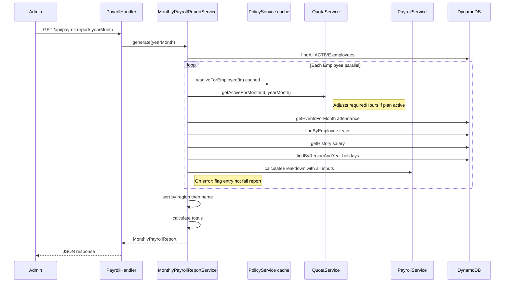
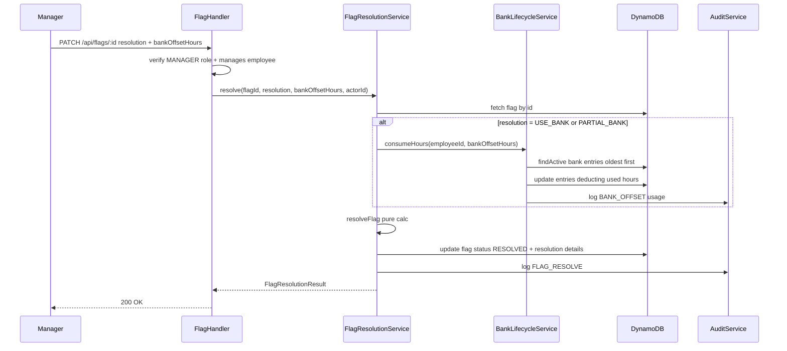
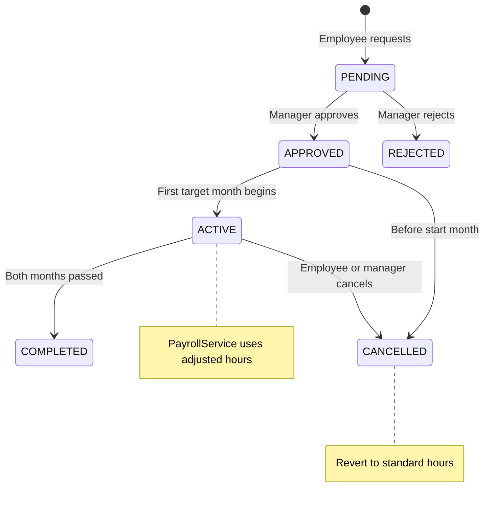
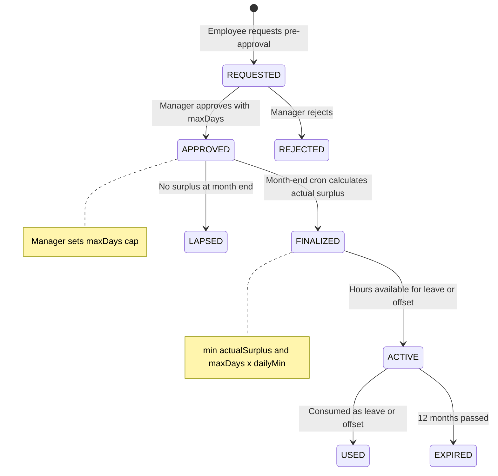

# Design Document — Monthly Payroll Report

## Overview

**Purpose**: This feature delivers a comprehensive, policy-driven monthly payroll pipeline to admins and employees, replacing hardcoded payroll logic with a fully configurable system that handles two regions (JP labor law, NP contract law), salary blending, overtime tiers, allowances, deficit deductions with manager approval, quota redistribution, surplus hour banking, termination settlement, and report export.

**Users**: Employees view their own monthly payroll breakdown. Managers approve deficit flags, quota redistributions, and surplus banking for their direct reports. Admins generate organization-wide reports, manage transfer fees/exchange rates, trigger salary statement delivery, and process settlements.

**Impact**: Extends existing PayrollService, MonthlyPayrollReportService, and FlagService with persistence and policy integration. Introduces new services for quota redistribution, settlement, and force majeure. Adds PolicyService caching. Completes the flag→deduction→payroll pipeline that is currently broken at the persistence layer.

### Goals
- All payroll rules driven by 4-level policy cascade — zero hardcoded business values
- Complete flag resolution → bank offset → deduction pipeline with DB persistence
- Quota redistribution with manager approval and payroll integration
- Surplus hour banking with 3-phase lifecycle and expiry management
- CSV export and salary statement email delivery
- Termination settlement with quota unwind and leave payout

### Non-Goals
- Payroll approval workflow (finalize/lock monthly payroll) — deferred
- PDF salary statement generation — email HTML only for v1
- Automated tax withholding or social insurance calculations
- Slack-based payroll notifications
- Multi-currency auto-conversion (exchange rates are manual input)
- Bonus/commission input UI (data model ready, input flow deferred)

## Architecture

### Existing Architecture Analysis

The system follows hexagonal architecture: Handler → Service → Repository. Services live in `packages/core` (zero AWS deps), repositories are interfaces in `packages/core/src/repositories/`, and DynamoDB implementations live in `packages/data/src/dynamo/`. Composition root in `packages/api/src/composition.ts` wires everything via constructor DI.

**Current gaps**:
- `resolveFlag()` and `applyBankOffset()` are pure functions — handlers don't persist results
- `MonthlyPayrollReportService` doesn't pass BlendingDetails through to breakdown
- Allowances hardcoded to `[]`, bonus/commission to `0`
- No QuotaPlan repository or API
- PolicyService has no caching

### Architecture Pattern & Boundary Map

```mermaid
graph TB
    subgraph Frontend
        PayrollPage[PayrollPage]
        PayrollReportTab[PayrollReportTab]
        QuotaUI[QuotaRequestForm]
        BankUI[BankBalancePanel]
    end

    subgraph API Handlers
        PayrollHandler[payroll handler]
        FlagHandler[flag handler]
        BankHandler[bank handler]
        QuotaHandler[quota handler]
        SettlementHandler[settlement handler]
        ForceMajeureHandler[force-majeure handler]
    end

    subgraph Core Services
        PayrollService[PayrollService]
        MonthlyReport[MonthlyPayrollReportService]
        FlagResolution[FlagResolutionService NEW]
        QuotaService[QuotaService NEW]
        BankLifecycle[BankLifecycleService NEW]
        SettlementService[SettlementService NEW]
        ForceMajeureService[ForceMajeureService NEW]
        PolicyService[PolicyService with cache]
        CronService[CronService extended]
        AuditService[AuditService]
    end

    subgraph Repositories
        FlagRepo[FlagRepository]
        BankRepo[BankRepository]
        QuotaPlanRepo[QuotaPlanRepository NEW]
        ForceMajeureRepo[ForceMajeureRepository NEW]
        PayrollAdjRepo[PayrollAdjustmentRepository NEW]
        SalaryRepo[SalaryRepository]
        PolicyRepo[PolicyRepository]
        AuditRepo[AuditRepository]
    end

    subgraph Data Layer
        DynamoDB[(DynamoDB Single Table)]
        SES[SES Email]
    end

    PayrollPage --> PayrollHandler
    PayrollReportTab --> PayrollHandler
    QuotaUI --> QuotaHandler
    BankUI --> BankHandler

    PayrollHandler --> PayrollService
    PayrollHandler --> MonthlyReport
    FlagHandler --> FlagResolution
    BankHandler --> BankLifecycle
    QuotaHandler --> QuotaService
    SettlementHandler --> SettlementService
    ForceMajeureHandler --> ForceMajeureService

    PayrollService --> PolicyService
    PayrollService --> SalaryRepo
    MonthlyReport --> PayrollService
    MonthlyReport --> QuotaService
    FlagResolution --> FlagRepo
    FlagResolution --> BankLifecycle
    FlagResolution --> AuditService
    QuotaService --> QuotaPlanRepo
    QuotaService --> AuditService
    BankLifecycle --> BankRepo
    BankLifecycle --> AuditService
    SettlementService --> PayrollService
    SettlementService --> QuotaService
    SettlementService --> BankLifecycle
    ForceMajeureService --> ForceMajeureRepo
    PolicyService --> PolicyRepo
    CronService --> BankLifecycle
    CronService --> FlagResolution

    FlagRepo --> DynamoDB
    BankRepo --> DynamoDB
    QuotaPlanRepo --> DynamoDB
    ForceMajeureRepo --> DynamoDB
    PayrollAdjRepo --> DynamoDB
    SalaryRepo --> DynamoDB
    PolicyRepo --> DynamoDB
    AuditRepo --> DynamoDB
    MonthlyReport -.-> SES
```



**Architecture Integration**:
- Selected pattern: Hexagonal (ports & adapters) — extending existing pattern
- New services: FlagResolutionService, QuotaService, BankLifecycleService, SettlementService, ForceMajeureService
- New repositories: QuotaPlanRepository, ForceMajeureRepository, PayrollAdjustmentRepository
- Extended services: PayrollService (policy-driven allowances, holiday subtraction), MonthlyPayrollReportService (error handling, sorting, blending), PolicyService (TTL cache), CronService (bank finalization, expiry notifications)

### Technology Stack

| Layer | Choice / Version | Role in Feature | Notes |
|-------|------------------|-----------------|-------|
| Frontend | React 19, styled-components 6, react-query | PayrollPage updates, CSV export, quota/bank UI | Client-side CSV via Blob |
| Backend | Node.js 20, TypeScript, Express (dev) / Lambda (prod) | Handlers, services, composition | 5 new services, 3 new repos |
| Data | DynamoDB single-table | All entities: flags, bank, quota, adjustments, force majeure | Existing table, new key patterns |
| Email | AWS SES | Salary statement delivery | Existing adapter, needs wiring |
| Scheduler | EventBridge (prod), manual (dev) | Bank finalization cron, expiry cleanup | Extend existing CronService |

## System Flows

### Flow 1: Monthly Payroll Report Generation



### Flow 2: Flag Resolution with Bank Offset



### Flow 3: Quota Redistribution Lifecycle



### Flow 4: Surplus Banking Lifecycle



## Requirements Traceability

| Req | Summary | Components | Interfaces | Flows |
|-----|---------|------------|------------|-------|
| 1.1-1.7 | Policy-driven hours resolution | PayrollService, PolicyService, QuotaService | PayrollService.calculateHoursSummary | Flow 1 |
| 2.1-2.4 | Salary blending | PayrollService, SalaryRepository | PayrollService.getBreakdown | Flow 1 |
| 3.1-3.6 | Overtime calculation | OvertimeCalculator, PayrollService | OvertimeCalculator existing | Flow 1 |
| 4.1-4.4 | Allowance management | PayrollService, PolicyService | PayrollService.getBreakdown | Flow 1 |
| 5.1-5.7 | Deficit with manager approval | FlagResolutionService, BankLifecycleService | FlagResolutionService.resolve | Flow 2 |
| 6.1-6.5 | Monthly report generation | MonthlyPayrollReportService | MonthlyPayrollReportService.generate | Flow 1 |
| 7.1-7.5 | Transfer fees and exchange rates | PayrollAdjustmentRepository, PayrollService | PayrollHandler PATCH adjustment | Flow 1 |
| 8.1-8.3 | Pro-rata salary | PayrollCalculator | calculateProRata existing | Flow 1 |
| 9.1-9.12 | RBAC for all features | All handlers, Permissions | requirePermission middleware | All flows |
| 10.1-10.4 | CSV export | PayrollReportTab frontend | generatePayrollCsv utility | — |
| 11.1-11.7 | Payroll UI employee | PayrollPage | usePayroll hook | — |
| 12.1-12.7 | Payroll UI admin | PayrollReportTab | usePayrollReport hook | — |
| 13.1-13.4 | Salary statement delivery | SalaryStatementService, SESEmailAdapter | SalaryStatementService.sendForMonth | — |
| 14.1-14.4 | PolicyService caching | PolicyService | PolicyCache internal | Flow 1 |
| 15.1-15.6 | Audit trail | AuditService, AuditRepository | AuditRepository.append | All flows |
| 16.1-16.8 | Quota redistribution | QuotaService, QuotaPlanRepository | QuotaService.request/approve | Flow 3 |
| 17.1-17.8 | Surplus hour banking | BankLifecycleService, BankRepository | BankLifecycleService.request/approve/finalize | Flow 4 |
| 18.1-18.6 | Surplus bank offset | FlagResolutionService, BankLifecycleService | BankLifecycleService.consumeHours | Flow 2 |
| 19.1-19.5 | Termination settlement | SettlementService | SettlementService.calculate | — |
| 20.1-20.4 | Force majeure | ForceMajeureService, ForceMajeureRepository | ForceMajeureService.record | — |
| 21.1-21.4 | Policy-driven config | PolicyService, policy types, region defaults | EffectivePolicy expanded | — |

## Components and Interfaces

| Component | Domain/Layer | Intent | Req Coverage | Key Dependencies | Contracts |
|-----------|-------------|--------|--------------|------------------|-----------|
| PolicyService (extended) | Core/Policy | Resolve policy cascade with TTL cache | 1, 14, 21 | PolicyRepository (P0) | Service |
| PayrollService (extended) | Core/Payroll | Calculate breakdown with policy-driven values | 1-5, 7-8 | PolicyService (P0), SalaryRepo (P0), QuotaService (P1) | Service |
| MonthlyPayrollReportService (extended) | Core/Payroll | Generate monthly report for all employees | 6 | PayrollService (P0), EmployeeRepo (P0) | Service |
| FlagResolutionService | Core/Flags | Persist flag resolution with bank offset | 5, 18 | FlagRepo (P0), BankLifecycleService (P1), AuditService (P1) | Service, API |
| QuotaService | Core/Quota | Manage quota redistribution lifecycle | 16 | QuotaPlanRepo (P0), AuditService (P1) | Service, API |
| BankLifecycleService | Core/Banking | Manage surplus banking 3-phase lifecycle | 17, 18 | BankRepo (P0), AuditService (P1) | Service, API |
| SettlementService | Core/Settlement | Calculate termination settlement | 19 | PayrollService (P0), QuotaService (P1), BankLifecycleService (P1) | Service, API |
| ForceMajeureService | Core/ForceMajeure | Record and apply force majeure events | 20 | ForceMajeureRepo (P0), AuditService (P1) | Service, API |
| SalaryStatementService | Core/Payroll | Generate and send salary statements | 13 | MonthlyPayrollReportService (P0), EmailAdapter (P1) | Service |
| QuotaPlanRepository | Data/DynamoDB | Persist quota plans | 16 | DynamoDB client (P0) | State |
| ForceMajeureRepository | Data/DynamoDB | Persist force majeure events | 20 | DynamoDB client (P0) | State |
| PayrollAdjustmentRepository | Data/DynamoDB | Persist transfer fees and exchange rates | 7 | DynamoDB client (P0) | State |
| PayrollReportTab (extended) | Web/Admin | Admin report with export + expanded entries | 10, 12 | usePayrollReport (P0) | — |
| PayrollPage (extended) | Web/Employee | Employee breakdown with quota + bank display | 11 | usePayroll (P0) | — |
| QuotaRequestForm | Web/Employee | Request quota redistribution | 16 | useQuotaRedistribution (P0) | — |

### Core / Policy

#### PolicyService (Extended)

| Field | Detail |
|-------|--------|
| Intent | Resolve 4-level policy cascade with in-memory TTL cache |
| Requirements | 1.1, 14.1-14.4, 21.1-21.3 |

**Responsibilities & Constraints**
- Resolve EffectivePolicy per employee via region → company → group → employee cascade
- Cache resolved policies per employee with configurable TTL (default 5 minutes)
- Invalidate cache on any policy write operation
- Cache at 3 levels: company (shared), group (shared per group), employee (unique)

**Contracts**: Service [x]

##### Service Interface
```typescript
interface PolicyService {
  resolveForEmployee(employeeId: string, referenceDate?: Date): Promise<EffectivePolicy>;
  invalidateCache(scope: 'all' | 'company' | { group: string } | { employee: string }): void;
}

interface PolicyCache {
  readonly companyPolicy: CacheEntry<RawPolicy> | null;
  readonly groupPolicies: Map<string, CacheEntry<RawPolicy>>;
  readonly employeePolicies: Map<string, CacheEntry<EffectivePolicy>>;
}

interface CacheEntry<T> {
  readonly value: T;
  readonly expiresAt: number;
}
```
- Preconditions: Employee exists with valid region and employmentType
- Postconditions: Returns fully resolved EffectivePolicy with all fields populated (region defaults as fallback)
- Invariants: Cache entries never outlive TTL; policy writes always invalidate affected cache entries

**Implementation Notes**
- Integration: Extend existing `PolicyService` class; add private `cache` field
- Validation: TTL check on every cache read; stale entries treated as miss
- Risks: Lambda cold start clears cache — acceptable for ~25 employees

### Core / Payroll

#### PayrollService (Extended)

| Field | Detail |
|-------|--------|
| Intent | Calculate policy-driven payroll breakdown with leave type credits, holiday subtraction, allowances, and quota-adjusted hours |
| Requirements | 1.1-1.7, 2.1-2.4, 3.1-3.6, 4.1-4.4, 5.1, 7.1-7.5, 8.1-8.3 |

**Responsibilities & Constraints**
- Read all payroll values from resolved EffectivePolicy (never hardcoded)
- Apply leave type hour credits: PAID and CREDITED_ABSENCE credit `dailyMinimum`, others credit 0
- Subtract holidays from required working days
- Use quota-adjusted hours when QuotaPlan is active for the target month
- Include allowances from policy, transfer fees from PayrollAdjustment
- Pass BlendingDetails through to breakdown

**Dependencies**
- Inbound: MonthlyPayrollReportService — breakdown per employee (P0)
- Outbound: PolicyService — policy resolution (P0), SalaryRepository — salary history (P0), QuotaService — adjusted hours (P1), HolidayRepository — holiday count (P1), PayrollAdjustmentRepository — transfer fees (P1)

**Contracts**: Service [x]

##### Service Interface
```typescript
interface PayrollService {
  getBreakdown(employeeId: string, yearMonth: string): Promise<PayrollBreakdown | null>;
  getSalaryHistory(employeeId: string): Promise<readonly SalaryRecord[]>;
  addSalaryEntry(entry: SalaryRecord): Promise<SalaryRecord>;
}

// Internal method (used by MonthlyPayrollReportService)
// calculateHoursSummary resolves required hours considering:
// - policy monthlyMinimum (or quota-adjusted)
// - holidays for employee's region
// - leave type credits (PAID, CREDITED_ABSENCE = dailyMinimum; others = 0)
// - attendance events (actual worked hours)
// Returns: HoursSummary with worked, required, leaveCredits, creditedAbsence, deficit, surplus, overtime
```

#### MonthlyPayrollReportService (Extended)

| Field | Detail |
|-------|--------|
| Intent | Generate monthly report for all active employees with error isolation and sorting |
| Requirements | 6.1-6.5 |

**Responsibilities & Constraints**
- Generate per-employee entries in parallel via `Promise.allSettled` (not `Promise.all`)
- On individual failure: include employee entry with `error` field, continue processing
- Sort entries: JP region first, then NP, alphabetical by name within region
- Include BlendingDetails in each entry's PayrollBreakdown
- Query QuotaService for active redistributions per employee

**Contracts**: Service [x]

##### Service Interface
```typescript
interface MonthlyPayrollReportService {
  generate(yearMonth: string): Promise<MonthlyPayrollReport>;
}

interface MonthlyPayrollReportEntry {
  readonly employeeId: string;
  readonly employeeName: string;
  readonly employmentType: string;
  readonly region: Region;
  readonly hours: HoursSummary;
  readonly payroll: PayrollBreakdown;
  readonly quotaAdjusted: boolean;
  readonly error?: string;
}
```

### Core / Flags

#### FlagResolutionService (New)

| Field | Detail |
|-------|--------|
| Intent | Persist flag resolution with bank offset debit and audit trail |
| Requirements | 5.2-5.7, 18.1-18.6 |

**Responsibilities & Constraints**
- Wrap existing `resolveFlag()` pure function with persistence layer
- On USE_BANK/PARTIAL_BANK: debit hours from BankLifecycleService before calculating deduction
- Persist resolved flag with: resolution, resolverId, bankOffsetHours, resolvedAt
- Enforce no retroactive reversal: deficit in Month N stays even if surplus in Month N+1
- Log all resolutions to AuditService

**Dependencies**
- Inbound: FlagHandler — HTTP resolution requests (P0)
- Outbound: FlagRepository — persist resolution (P0), BankLifecycleService — consume hours (P1), AuditService — audit log (P1)

**Contracts**: Service [x] / API [x]

##### Service Interface
```typescript
interface FlagResolutionService {
  resolve(input: FlagResolutionInput): Promise<FlagResolutionResult>;
  getPendingForManager(managerId: string): Promise<readonly Flag[]>;
}

interface FlagResolutionInput {
  readonly flagId: string;
  readonly resolution: FlagResolution;
  readonly bankOffsetHours?: number;
  readonly actorId: string;
}

interface FlagResolutionResult {
  readonly flag: Flag;
  readonly deductionAmount: number;
  readonly bankHoursUsed: number;
  readonly adjustedDeficit: number;
}
```
- Preconditions: Flag exists and status is PENDING; actor has FLAG_RESOLVE permission and manages employee
- Postconditions: Flag status set to RESOLVED; bank entries debited if offset used; audit entry created
- Invariants: Bank debit and flag update use DynamoDB `TransactWriteItems` (both entities in same table) to guarantee atomicity — no partial state

##### API Contract
| Method | Endpoint | Request | Response | Errors |
|--------|----------|---------|----------|--------|
| PATCH | /api/flags/:id | `{ resolution, bankOffsetHours? }` | FlagResolutionResult | 400 invalid, 403 forbidden, 404 not found |
| GET | /api/flags | `?status=PENDING` | `Flag[]` | 403 forbidden |

### Core / Quota

#### QuotaService (New)

| Field | Detail |
|-------|--------|
| Intent | Manage quota redistribution lifecycle: request, approve, track, integrate with payroll |
| Requirements | 16.1-16.8 |

**Responsibilities & Constraints**
- Validate total hours across two months equals standard total (e.g., 140+180 = 2×160)
- Reject requests where first target month has already started
- Track plan status: PENDING → APPROVED → ACTIVE → COMPLETED/CANCELLED
- Provide adjusted required hours to PayrollService for active plans
- On termination: support unwind calculation (revert to standard hours)

**Dependencies**
- Outbound: QuotaPlanRepository — persistence (P0), PolicyService — standard hours (P0), AuditService — audit log (P1)

**Contracts**: Service [x] / API [x]

##### Service Interface
```typescript
interface QuotaService {
  request(input: QuotaRequestInput): Promise<QuotaPlan>;
  approve(planId: string, actorId: string): Promise<QuotaPlan>;
  reject(planId: string, actorId: string, reason: string): Promise<QuotaPlan>;
  cancel(planId: string, actorId: string): Promise<QuotaPlan>;
  getActiveForMonth(employeeId: string, yearMonth: string): Promise<QuotaPlan | null>;
  getPlansForEmployee(employeeId: string): Promise<readonly QuotaPlan[]>;
  calculateTerminationUnwind(employeeId: string, terminationDate: string): Promise<QuotaUnwindResult>;
}

interface QuotaRequestInput {
  readonly employeeId: string;
  readonly months: readonly [QuotaMonth, QuotaMonth];
  readonly reason: string;
  readonly requesterId: string;
}

interface QuotaUnwindResult {
  readonly standardHoursTotal: number;
  readonly actualWorkedTotal: number;
  readonly shortfall: number;
  readonly deductionAmount: number;
}
```
- Preconditions: Employee active; first month not yet started; total hours balanced
- Postconditions: Plan stored with PENDING status; approval changes to APPROVED
- Invariants: Salary unchanged regardless of redistribution; only one active plan per employee at a time — enforced via DynamoDB `ConditionExpression` on write: query for any non-terminal status (PENDING/APPROVED/ACTIVE) before creating a new plan

##### API Contract
| Method | Endpoint | Request | Response | Errors |
|--------|----------|---------|----------|--------|
| POST | /api/quotas | QuotaRequestInput | QuotaPlan | 400 validation, 403 forbidden, 409 plan exists |
| PATCH | /api/quotas/:planId/approve | `{ actorId }` | QuotaPlan | 403, 404, 409 already resolved |
| PATCH | /api/quotas/:planId/reject | `{ actorId, reason }` | QuotaPlan | 403, 404 |
| DELETE | /api/quotas/:planId | — | QuotaPlan | 403, 404 |
| GET | /api/quotas/:employeeId | `?yearMonth` | QuotaPlan or QuotaPlan[] | 403 |

### Core / Banking

#### BankLifecycleService (New)

| Field | Detail |
|-------|--------|
| Intent | Manage 3-phase surplus banking: request → approve → finalize, plus consumption and expiry |
| Requirements | 17.1-17.8, 18.1-18.6 |

**Responsibilities & Constraints**
- 3-phase lifecycle: REQUESTED → APPROVED (with maxDays) → FINALIZED (at month-end)
- Finalization: `bankableHours = min(actualSurplus, maxDays × dailyMinimum)`
- Consumption: debit hours oldest-first from active entries (existing `applyBankOffset` logic)
- Expiry: mark entries EXPIRED after 12 months (configurable via policy `surplusBankingExpiryMonths`)
- Unapproved surplus has zero value — enforce at consumption time
- No retroactive reversal: deficit deduction in Month N cannot be undone by surplus in Month N+1

**Dependencies**
- Inbound: FlagResolutionService — consume hours for offset (P0), CronService — finalize + expire (P0)
- Outbound: BankRepository — persistence (P0), AuditService — audit log (P1)

**Contracts**: Service [x] / API [x]

##### Service Interface
```typescript
interface BankLifecycleService {
  request(input: BankRequestInput): Promise<BankEntry>;
  approve(entryId: string, maxDays: number, actorId: string): Promise<BankEntry>;
  reject(entryId: string, actorId: string): Promise<BankEntry>;
  finalize(employeeId: string, yearMonth: string, actualSurplus: number): Promise<BankEntry | null>;
  consumeHours(employeeId: string, hours: number): Promise<BankConsumptionResult>;
  getBalance(employeeId: string): Promise<BankBalance>;
  expireEntries(asOfDate: string): Promise<number>;
}

interface BankRequestInput {
  readonly employeeId: string;
  readonly yearMonth: string;
  readonly requesterId: string;
}

interface BankConsumptionResult {
  readonly hoursConsumed: number;
  readonly entriesDebited: readonly BankEntryDebit[];
  readonly remainingBalance: number;
}

interface BankBalance {
  readonly totalAvailable: number;
  readonly entries: readonly BankEntry[];
  readonly nearingExpiry: readonly BankEntry[];
}
```

##### API Contract
| Method | Endpoint | Request | Response | Errors |
|--------|----------|---------|----------|--------|
| POST | /api/bank | `{ employeeId, yearMonth }` | BankEntry | 400, 403, 409 already requested |
| PATCH | /api/bank/:id/approve | `{ maxDays }` | BankEntry | 403, 404 |
| PATCH | /api/bank/:id/reject | — | BankEntry | 403, 404 |
| GET | /api/bank/balance/:employeeId | — | BankBalance | 403 |

### Core / Settlement

#### SettlementService (New)

| Field | Detail |
|-------|--------|
| Intent | Calculate comprehensive termination settlement |
| Requirements | 19.1-19.5 |

**Responsibilities & Constraints**
- Pro-rata salary: `baseSalary × (calendarDaysWorked / totalCalendarDays)`
- Unused leave payout: `unusedDays × (monthlySalary / workingDaysInMonth)`
- Quota unwind: recalculate using standard hours, deduct net shortfall at hourly rate
- Bank hours: forfeit on termination (per NP contract; JP follows LABOR_LAW from policy)
- Pending flag deductions: include if manager-approved
- Settlement deadline: 15th of month following termination

**Dependencies**
- Outbound: PayrollService — pro-rata calculation (P0), QuotaService — unwind calculation (P0), BankLifecycleService — balance check (P1), LeaveRepository — balance lookup (P1)

**Contracts**: Service [x] / API [x]

##### Service Interface
```typescript
interface SettlementService {
  calculate(input: SettlementInput): Promise<SettlementBreakdown>;
}

interface SettlementInput {
  readonly employeeId: string;
  readonly terminationDate: string;
  readonly actorId: string;
}

interface SettlementBreakdown {
  readonly employeeId: string;
  readonly terminationDate: string;
  readonly settlementDeadline: string;
  readonly proRataSalary: number;
  readonly unusedLeavePayout: number;
  readonly unusedLeaveDays: number;
  readonly pendingDeductions: number;
  readonly quotaUnwindDeduction: number;
  readonly bankHoursForfeited: number;
  readonly netSettlement: number;
  readonly currency: Currency;
  readonly lineItems: readonly SettlementLineItem[];
}
```

##### API Contract
| Method | Endpoint | Request | Response | Errors |
|--------|----------|---------|----------|--------|
| GET | /api/settlement/:employeeId | `?terminationDate` | SettlementBreakdown | 403, 404 |

### Core / Force Majeure

#### ForceMajeureService (New)

| Field | Detail |
|-------|--------|
| Intent | Record force majeure events and apply hour adjustments |
| Requirements | 20.1-20.4 |

**Responsibilities & Constraints**
- Admin records event with: date range, description, affected employees
- Apply proportional hour adjustment: `adjustedRequired = required × (workDays - affectedDays) / workDays`
- Track consecutive days for 30-day termination trigger (configurable via policy)
- Credited hours shown as separate line item in PayrollBreakdown

**Dependencies**
- Outbound: ForceMajeureRepository — persistence (P0), AuditService — audit log (P1)

**Contracts**: Service [x] / API [x]

##### Service Interface
```typescript
interface ForceMajeureService {
  record(input: ForceMajeureInput): Promise<ForceMajeureEvent>;
  getForEmployeeMonth(employeeId: string, yearMonth: string): Promise<readonly ForceMajeureEvent[]>;
  calculateAdjustment(employeeId: string, yearMonth: string, requiredHours: number, workDays: number): Promise<ForceMajeureAdjustment>;
}

interface ForceMajeureInput {
  readonly startDate: string;
  readonly endDate: string;
  readonly description: string;
  readonly affectedEmployeeIds: readonly string[];
  readonly actorId: string;
}
```

##### API Contract
| Method | Endpoint | Request | Response | Errors |
|--------|----------|---------|----------|--------|
| POST | /api/force-majeure | ForceMajeureInput | ForceMajeureEvent | 400, 403 |
| GET | /api/force-majeure | `?employeeId&yearMonth` | ForceMajeureEvent[] | 403 |

### Core / Payroll (Email)

#### SalaryStatementService (New)

| Field | Detail |
|-------|--------|
| Intent | Generate and deliver salary statements via email |
| Requirements | 13.1-13.4 |

**Contracts**: Service [x]

##### Service Interface
```typescript
interface SalaryStatementService {
  sendForMonth(yearMonth: string, actorId: string): Promise<SalaryStatementResult>;
  sendForEmployee(employeeId: string, yearMonth: string): Promise<boolean>;
}

interface SalaryStatementResult {
  readonly sent: number;
  readonly failed: number;
  readonly failures: readonly { employeeId: string; error: string }[];
}
```

**Implementation Notes**
- Uses existing `renderSalaryStatementHtml()` template from `packages/data/src/ses/salary-template.ts`
- Wire `SESEmailAdapter` in composition root (with NoopEmailAdapter for local dev)
- Send in parallel with individual try-catch per employee
- Log failures to AuditService, continue sending to remaining employees

### Web / Frontend

#### CSV Export Utility (New)

| Field | Detail |
|-------|--------|
| Intent | Client-side CSV generation from payroll report data |
| Requirements | 10.1-10.4 |

**Implementation Notes**
- Pure utility function `generatePayrollCsv(report: MonthlyPayrollReport): string`
- Include BOM (`\uFEFF`) for Excel UTF-8 compatibility
- NP employees get extra columns: exchangeRate, transferFee, jpyEquivalent
- Summary row at bottom with totals
- Download via `Blob` + `URL.createObjectURL` + temporary `<a>` element

#### PayrollReportTab (Extended)

Summary-only — extend existing component with:
- CSV export button calling `generatePayrollCsv` utility (10.1-10.4)
- Expandable employee rows showing full PayrollBreakdown (12.3)
- Badge for employees with active quota redistributions (12.5)
- Deficit count badge (12.4)

#### PayrollPage (Extended)

Summary-only — extend existing component with:
- Quota redistribution indicator when active (11.5)
- Bank offset display in deficit section (11.2)
- Approval status on deficit deduction line (11.2)

## Data Models

### Domain Model

**Aggregates**:
- **Employee** (root) — owns attendance, flags, bank entries, quota plans, salary history
- **QuotaPlan** — spans two months, owned by employee, independent lifecycle
- **ForceMajeureEvent** — spans date range, affects multiple employees
- **PayrollAdjustment** — per employee per month (transfer fees, exchange rates)

### Physical Data Model (DynamoDB Key Patterns)

All entities use single-table design. New key patterns:

| Entity | PK | SK | GSI1PK | GSI1SK | Notes |
|--------|----|----|--------|--------|-------|
| QuotaPlan | `EMP#{employeeId}` | `QUOTA#{planId}` | `QUOTA_STATUS#{status}` | `{startMonth}#EMP#{employeeId}` | Query by status, by month |
| ForceMajeureEvent | `FM#{eventId}` | `META` | `FM_MONTH#{yearMonth}` | `{startDate}` | Query events by month |
| ForceMajeureAffected | `EMP#{employeeId}` | `FM#{eventId}` | — | — | Per-employee lookup |
| PayrollAdjustment | `EMP#{employeeId}` | `PADJ#{yearMonth}` | — | — | One per employee per month |

Existing entities (schema extended — no migration needed, app is in development):
- **Flag**: Add fields `resolution`, `resolvedBy`, `resolvedAt`, `bankOffsetHours` to existing record
- **BankEntry**: Add field `status` (REQUESTED/APPROVED/FINALIZED/EXPIRED/USED), `maxApprovedDays`, `finalizedHours`
- **Seed data**: Update `scripts/seed-data.ts` and `scripts/seed-policies.ts` to include new policy fields (surplusBanking, quotaRedistribution, forceMajeure) in region defaults and group policies

### Policy Type Expansion

New fields added to `RawPolicy` (all optional, with region defaults):

```typescript
// Added to existing policy interfaces
interface SurplusBankingPolicy {
  readonly expiryMonths: number;           // default: 12
  readonly maxBankedDays: number;          // default: 20
  readonly eligibleForBanking: boolean;    // default: true
  readonly expiryWarningDays: number;      // default: 30
}

interface QuotaRedistributionPolicy {
  readonly eligible: boolean;              // default: true
  readonly maxRedistributionPercent: number; // default: 25 (max deviation from standard)
}

interface ForceMajeurePolicy {
  readonly terminationThresholdDays: number; // default: 30
}

// Extended in EffectivePolicy
interface EffectivePolicy {
  // ... existing fields ...
  readonly surplusBanking: SurplusBankingPolicy;
  readonly quotaRedistribution: QuotaRedistributionPolicy;
  readonly forceMajeure: ForceMajeurePolicy;
}
```

### Data Contracts

**Leave Type Hour Credit Mapping** (in PayrollService, driven by policy):

| Leave Type | Hour Credit | Balance Impact |
|------------|------------|----------------|
| PAID | dailyMinimum (8h) | Deducts from balance |
| UNPAID | 0 | No impact |
| SHIFT_PERMISSION | 0 | No impact (compensate later) |
| CREDITED_ABSENCE | dailyMinimum (8h) | No impact (special approval) |
| BEREAVEMENT | dailyMinimum (8h) | No impact |
| MATERNITY | dailyMinimum (8h) | No impact |

## Error Handling

### Error Strategy
- Individual employee failures in report generation: isolate with error flag, continue processing
- Bank offset insufficient hours: return partial offset with remaining deficit
- Quota validation failure: return 400 with specific field errors
- Policy resolution failure: use region defaults as fallback, log warning
- Email delivery failure: log per-employee, continue batch

### Error Categories
- **400 Bad Request**: Invalid quota hours (don't sum to standard), invalid yearMonth format, bank request for past month
- **403 Forbidden**: Missing permission, manager doesn't manage employee
- **404 Not Found**: Flag/plan/entry not found
- **409 Conflict**: Quota plan already exists for employee, bank request already exists for month
- **422 Unprocessable**: Salary missing for employee, policy resolution failed

## Testing Strategy

### Unit Tests
- `PolicyService` cache: TTL expiry, invalidation on write, cascade correctness
- `FlagResolutionService`: resolve with each resolution type, bank offset calculation, no retroactive reversal
- `QuotaService`: validation (hours must balance), rejection of past-month plans, unwind calculation
- `BankLifecycleService`: 3-phase lifecycle, finalization with surplus cap, consumption oldest-first, expiry
- `SettlementService`: pro-rata + leave payout + quota unwind + bank forfeit

### Integration Tests
- Full payroll pipeline: policy → hours → overtime → allowances → deficit → breakdown
- Flag resolution → bank debit → audit trail (persistence chain)
- Quota redistribution → payroll uses adjusted hours → no deficit flags
- Monthly report generation with one failing employee (error isolation)

### E2E Tests
- Admin generates monthly report, exports CSV, verifies totals
- Manager resolves deficit flag with bank offset, employee sees updated payroll
- Employee requests quota redistribution, manager approves, dashboard shows adjusted hours

## Security Considerations

### New Permissions

| Permission | Assigned To | Purpose |
|------------|------------|---------|
| `quota:manage` | MANAGER+ | Approve/reject quota redistributions for managed employees |
| `force_majeure:manage` | ADMIN+ | Record and manage force majeure events |

Existing permissions cover remaining needs:
- `flag:resolve` — deficit resolution (MANAGER+)
- `bank:approve` — surplus banking approval (MANAGER+)
- `admin:salary_manage` — report, export, settlement, salary statements, transfer fees (ADMIN+)

All endpoints enforce `requireCrossUserAccess()` — managers can only act on employees they manage.

## Performance & Scalability

### PolicyService Cache Impact
- Without cache: 4 DynamoDB reads × 25 employees = 100 reads per report
- With cache: 4 reads (first employee) + 1 read × 24 remaining (user-level only) = 28 reads
- Cache TTL: 5 minutes (configurable)

### Report Generation
- `Promise.allSettled` for parallel per-employee processing
- Target: <3s for 25 employees (current: ~2s without cache)
- Client-side CSV: <100ms for 25 employees
